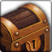

<!-- generated:start -->
<!-- generated-keys: title=9ca46a type=24f03d id=fe2ef4 sources=d211ae contents=d23380 value_4c=8a12a3 opened_by_guess=929f96 kind=364c90 -->
|  |  |
|---|---|
|  |  |
| **RandomBox id** | `46` |
| **Opened by** | [[wiki/items/1051-bronze-medal-reward-box\|(Bronze) Medal Reward Box]] (*guess*, not confirmed) |
| **Value @4c** | 10,000 (unknown; decoder guesses gold. The Lord of the Land reward box cost 300,000 gold to open, later 200,000 — [[gameplay/server-rules\|server rules]], WM 0426 / 0920 — so this may be the gold cost of opening: *guess*) |
| **Odds** | unknown (server side) |

### Contents

One of these is given when the box is used (contract `use_item`; *guess*: one roll per use). `p` is an unknown per-entry value (0–5; in rows 40–45 it rises with the box tier).

| slot |  | item | count | p |
|---|---|---|---|---|
| 0 |  | [[wiki/items/1021-gold\|Gold]] | 10,000 |  |
| 1 |  | [[wiki/items/1021-gold\|Gold]] | 10,000 |  |
| 2 |  | [[wiki/items/1021-gold\|Gold]] | 30,000 |  |
| 3 |  | [[wiki/items/1001-medal-silver\|Medal : Silver]] | 1 |  |
| 4 |  | [[wiki/items/1052-silver-medal-reward-box\|(Silver) Medal Reward Box]] | 1 |  |
| 5 |  | [[wiki/items/1052-silver-medal-reward-box\|(Silver) Medal Reward Box]] | 1 |  |
| 6 |  | [[wiki/items/7042-health-rune\|Health Rune]] | 1 |  |
| 7 |  | [[wiki/items/7052-mana-rune\|Mana Rune]] | 1 |  |
| 8 |  | [[wiki/items/7062-health-regeneration-rune\|Health Regeneration Rune]] | 1 |  |
| 9 |  | [[wiki/items/7072-mana-regeneration-rune\|Mana Regeneration Rune]] | 1 |  |

### Why this box item

No client column links a box item to a RandomBox row. The guess pairs rows and box items by number and contents: rows 20–25 ↔ Gaia boxes 1023–1028, 30–35 ↔ Box of the Victorious, 40–45 ↔ Box of the Participant, 46–50 ↔ the medal reward boxes, 51 ↔ the Halloween box (it holds the Jack transform scroll), 81–83 ↔ the dye boxes. Set `opened_by:` once a source confirms it.

### Seen in

- Seen in [[gameplay/crush-mechanics|Crush Online mechanics from the forum]], section *7. Medals, contribution, arena*
- Seen in [[gameplay/crush-patch-notes|Crush Online patch notes 2016–17]], section *2016-12-15: Civil War ((t816); Steam 15 Dec)*
<!-- generated:end -->

## Notes

<!-- hand-written: add what you know, with a source -->

## Behaviour

<!-- hand-written: add what you know, with a source -->

## Sources

<!-- hand-written: add what you know, with a source -->

## Open questions

<!-- hand-written: add what you know, with a source -->

<!-- credit:start -->
---
*Game content © GAMESinFLAMES / Joyimpact; reproduced for preservation and reference.*
<!-- credit:end -->
