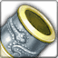
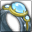
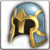
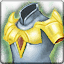
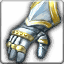
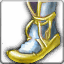
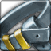

<!-- generated:start -->
<!-- generated-keys: title=a280c6 type=24f03d id=4d89d2 sources=4a75b0 contents=41869c value_4c=f8682d kind=364c90 -->
|  |  |
|---|---|
| **RandomBox id** | `67` |
| **Opened by** | unknown |
| **Value @4c** | 300,000 (unknown; decoder guesses gold. The Lord of the Land reward box cost 300,000 gold to open, later 200,000 — [[gameplay/server-rules\|server rules]], WM 0426 / 0920 — so this may be the gold cost of opening: *guess*) |
| **Odds** | unknown (server side) |

### Contents

One of these is given when the box is used (contract `use_item`; *guess*: one roll per use). `p` is an unknown per-entry value (0–5; in rows 40–45 it rises with the box tier).

| slot |  | item | count | p |
|---|---|---|---|---|
| 0 |  | [[wiki/items/3507-fame-knight-bracelet\|Fame knight Bracelet]] | 1 |  |
| 1 |  | [[wiki/items/3508-fame-knight-ring\|Fame knight Ring]] | 1 |  |
| 2 |  | [[wiki/items/3501-fame-knight-helmet\|Fame knight Helmet]] | 1 |  |
| 3 |  | [[wiki/items/3502-fame-knight-armor\|Fame knight Armor]] | 1 |  |
| 4 |  | [[wiki/items/3503-fame-knight-gloves\|Fame knight Gloves]] | 1 |  |
| 5 |  | [[wiki/items/3504-fame-knight-shoes\|Fame knight Shoes]] | 1 |  |
| 6 |  | [[wiki/items/3504-fame-knight-shoes\|Fame knight Shoes]] | 1 |  |
| 7 |  | [[wiki/items/3505-fame-knight-necklace\|Fame knight Necklace]] | 1 |  |
| 8 |  | [[wiki/items/3505-fame-knight-necklace\|Fame knight Necklace]] | 1 |  |
| 9 |  | [[wiki/items/3506-fame-knight-belt\|Fame knight Belt]] | 1 |  |
<!-- generated:end -->

## Notes

<!-- hand-written: add what you know, with a source -->

## Behaviour

<!-- hand-written: add what you know, with a source -->

## Sources

<!-- hand-written: add what you know, with a source -->

## Open questions

<!-- hand-written: add what you know, with a source -->

<!-- credit:start -->
---
*Game content © GAMESinFLAMES / Joyimpact; reproduced for preservation and reference.*
<!-- credit:end -->
