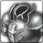
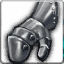
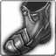
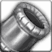

<!-- generated:start -->
<!-- generated-keys: title=443258 type=24f03d id=b4c96d sources=105a06 contents=90f9e0 value_4c=f8682d kind=364c90 -->
|  |  |
|---|---|
| **RandomBox id** | `68` |
| **Opened by** | unknown |
| **Value @4c** | 300,000 (unknown; decoder guesses gold. The Lord of the Land reward box cost 300,000 gold to open, later 200,000 — [[gameplay/server-rules\|server rules]], WM 0426 / 0920 — so this may be the gold cost of opening: *guess*) |
| **Odds** | unknown (server side) |

### Contents

One of these is given when the box is used (contract `use_item`; *guess*: one roll per use). `p` is an unknown per-entry value (0–5; in rows 40–45 it rises with the box tier).

| slot |  | item | count | p |
|---|---|---|---|---|
| 0 |  | [[wiki/items/3518-fame-warrior-ring\|Fame warrior Ring]] | 1 |  |
| 1 |  | [[wiki/items/3511-fame-warrior-helmet\|Fame warrior Helmet]] | 1 |  |
| 2 |  | [[wiki/items/3512-fame-warrior-armor\|Fame warrior Armor]] | 1 |  |
| 3 |  | [[wiki/items/3513-fame-warrior-gloves\|Fame warrior Gloves]] | 1 |  |
| 4 |  | [[wiki/items/3514-fame-warrior-shoes\|Fame warrior Shoes]] | 1 |  |
| 5 |  | [[wiki/items/3515-fame-warrior-necklace\|Fame warrior Necklace]] | 1 |  |
| 6 |  | [[wiki/items/3515-fame-warrior-necklace\|Fame warrior Necklace]] | 1 |  |
| 7 |  | [[wiki/items/3516-fame-warrior-belt\|Fame warrior Belt]] | 1 |  |
| 8 |  | [[wiki/items/3516-fame-warrior-belt\|Fame warrior Belt]] | 1 |  |
| 9 |  | [[wiki/items/3517-fame-warrior-bracelet\|Fame warrior Bracelet]] | 1 |  |
<!-- generated:end -->

## Notes

<!-- hand-written: add what you know, with a source -->

## Behaviour

<!-- hand-written: add what you know, with a source -->

## Sources

<!-- hand-written: add what you know, with a source -->

## Open questions

<!-- hand-written: add what you know, with a source -->

<!-- credit:start -->
---
*Game content © GAMESinFLAMES / Joyimpact; reproduced for preservation and reference.*
<!-- credit:end -->
