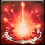

<!-- generated:start -->
<!-- generated-keys: title=a95705 type=6143a1 id=b19eeb sources=f4ca0f name_key=5ad1e9 duration=870e64 is_buff=b6589f stack_type=356a19 group=b6589f effects=97d170 icon=83e0e4 applied_by=423a62 -->
|  |  |
|---|---|
|  |  |
| **Buff id** | `10045` |
| **Duration** | 5 s (25 ticks of 200 ms; unit from [[gameplay/consumables]]) |
| **Buff / debuff** | flag 0 (is_buff?, guessed column) |
| **Stack type** | 1 (guessed column) |
| **Icon** | `ui/icons/Skill_Einsel_01.png` cell 21 |

### Tooltip

> Punishing Charge : You are able to use Punishing Stomp now

### Effects

No effect codes in the client: what this buff does (a stun, a mark, a status) is server-side. Add `effects:` by hand when known.

### Applied by

- Skill [[wiki/skills/5050-punishing-charge|Punishing Charge]], effect slot 1 (type 301, rate 100%)
- Skill [[wiki/skills/5051-punishing-stomp|Punishing Stomp]], effect slot 4 (type 305, rate 100%)
<!-- generated:end -->

## Notes

<!-- hand-written: add what you know, with a source -->

## Behaviour

<!-- hand-written: add what you know, with a source -->

## Sources

<!-- hand-written: add what you know, with a source -->

## Open questions

<!-- hand-written: add what you know, with a source -->

<!-- credit:start -->
---
*Game content © GAMESinFLAMES / Joyimpact; reproduced for preservation and reference.*
<!-- credit:end -->
