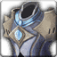

<!-- generated:start -->
<!-- generated-keys: title=54f21f type=6143a1 id=e50b86 sources=5b9b3b name_key=453dc2 duration=0aac5a is_buff=b6589f stack_type=356a19 group=b6589f effects=e6ae05 icon=0cdc1d applied_by=97d170 -->
|  |  |
|---|---|
|  |  |
| **Buff id** | `10126` |
| **Duration** | 3 s (15 ticks of 200 ms; unit from [[gameplay/consumables]]) |
| **Buff / debuff** | flag 0 (is_buff?, guessed column) |
| **Stack type** | 1 (guessed column) |
| **Icon** | `ui/icons/Items_02.png` cell 0 |

### Tooltip

> Resistance

### Effects

Effect codes read as `ItemOption` stat codes (*assumed*: a few rows disagree with their own tooltip, e.g. buff 1 "EXP +15%" uses code 41).

| code | effect | value |
|---|---|---|
| 118 | code 118 (unknown) | -15 |
<!-- generated:end -->

## Notes

<!-- hand-written: add what you know, with a source -->

## Behaviour

<!-- hand-written: add what you know, with a source -->

## Sources

<!-- hand-written: add what you know, with a source -->

## Open questions

<!-- hand-written: add what you know, with a source -->

<!-- credit:start -->
---
*Game content © GAMESinFLAMES / Joyimpact; reproduced for preservation and reference.*
<!-- credit:end -->
