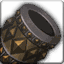

<!-- generated:start -->
<!-- generated-keys: title=aba502 type=6143a1 id=6700d0 sources=920508 name_key=2cd865 duration=6c749d is_buff=b6589f stack_type=356a19 group=b6589f effects=053c73 icon=2fd0e6 applied_by=97d170 -->
|  |  |
|---|---|
|  |  |
| **Buff id** | `10130` |
| **Duration** | 10 s (50 ticks of 200 ms; unit from [[gameplay/consumables]]) |
| **Buff / debuff** | flag 0 (is_buff?, guessed column) |
| **Stack type** | 1 (guessed column) |
| **Icon** | `ui/icons/Items_03.png` cell 0 |

### Tooltip

> Relentless

### Effects

Effect codes read as `ItemOption` stat codes (*assumed*: a few rows disagree with their own tooltip, e.g. buff 1 "EXP +15%" uses code 41).

| code | effect | value |
|---|---|---|
| 433 | code 433 (unknown) | 5 |
| 206 | code 206 (unknown) | 505 |
| 1001 | special 0x3e9 | 504 |
<!-- generated:end -->

## Notes

<!-- hand-written: add what you know, with a source -->

## Behaviour

<!-- hand-written: add what you know, with a source -->

## Sources

<!-- hand-written: add what you know, with a source -->

## Open questions

<!-- hand-written: add what you know, with a source -->

<!-- credit:start -->
---
*Game content © GAMESinFLAMES / Joyimpact; reproduced for preservation and reference.*
<!-- credit:end -->
