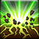

<!-- generated:start -->
<!-- generated-keys: title=bddd36 type=6143a1 id=ff97f1 sources=52fe7b name_key=a90189 duration=3d2da5 is_buff=b6589f stack_type=356a19 group=e3cbba effects=d5792e icon=b4ae95 applied_by=bceebf -->
|  |  |
|---|---|
|  |  |
| **Buff id** | `10154` |
| **Duration** | 4 s (20 ticks of 200 ms; unit from [[gameplay/consumables]]) |
| **Buff / debuff** | flag 0 (is_buff?, guessed column) |
| **Stack type** | 1 (guessed column) |
| **Group** | 1000 (+0x44 category; buffs of one group replace each other?) |
| **Icon** | `ui/icons/Skill_Dolorece_01.png` cell 26 |

### Tooltip

> Wrath Strike: Reduces Damage and Movement Speed

### Effects

Effect codes read as `ItemOption` stat codes (*assumed*: a few rows disagree with their own tooltip, e.g. buff 1 "EXP +15%" uses code 41).

| code | effect | value |
|---|---|---|
| 101 | Attack(%) | -30 |
| 119 | code 119 (unknown) | -70 |

### Applied by

- Skill [[wiki/skills/5131-strike-of-wrath|Strike of Wrath]], effect slot 3 (type 314, rate 100%)
<!-- generated:end -->

## Notes

<!-- hand-written: add what you know, with a source -->

## Behaviour

<!-- hand-written: add what you know, with a source -->

## Sources

<!-- hand-written: add what you know, with a source -->

## Open questions

<!-- hand-written: add what you know, with a source -->

<!-- credit:start -->
---
*Game content © GAMESinFLAMES / Joyimpact; reproduced for preservation and reference.*
<!-- credit:end -->
