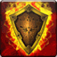

<!-- generated:start -->
<!-- generated-keys: title=28bcf5 type=6143a1 id=c38cfb sources=80838f name_key=d3fa62 duration=6c141f is_buff=b6589f stack_type=356a19 group=b6589f effects=da95f8 icon=30f6b2 applied_by=cf32dc -->
|  |  |
|---|---|
|  |  |
| **Buff id** | `10222` |
| **Duration** | permanent |
| **Buff / debuff** | flag 0 (is_buff?, guessed column) |
| **Stack type** | 1 (guessed column) |
| **Icon** | `ui/icons/Policy.png` cell 37 |

### Tooltip

> Group of Guardians : Increased damage

### Effects

Effect codes read as `ItemOption` stat codes (*assumed*: a few rows disagree with their own tooltip, e.g. buff 1 "EXP +15%" uses code 41).

| code | effect | value |
|---|---|---|
| 1 | Attack | 0 |
| 106 | Armor(%) | 30 |

### Applied by

- Skill [[wiki/skills/5188-guardian-avenger|Guardian Avenger]], effect slot 1 (type 303, rate 100%)
<!-- generated:end -->

## Notes

<!-- hand-written: add what you know, with a source -->

## Behaviour

<!-- hand-written: add what you know, with a source -->

## Sources

<!-- hand-written: add what you know, with a source -->

## Open questions

<!-- hand-written: add what you know, with a source -->

<!-- credit:start -->
---
*Game content © GAMESinFLAMES / Joyimpact; reproduced for preservation and reference.*
<!-- credit:end -->
