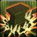

<!-- generated:start -->
<!-- generated-keys: title=6ba2ef type=6143a1 id=835369 sources=b55703 name_key=e96139 duration=2a0b1e is_buff=b6589f stack_type=356a19 group=c1dfd9 effects=97d170 icon=372eb2 applied_by=3537bc -->
|  |  |
|---|---|
|  |  |
| **Buff id** | `10349` |
| **Duration** | 2 s (10 ticks of 200 ms; unit from [[gameplay/consumables]]) |
| **Buff / debuff** | flag 0 (is_buff?, guessed column) |
| **Stack type** | 1 (guessed column) |
| **Group** | 6 (+0x44 category; buffs of one group replace each other?) |
| **Icon** | `ui/icons/Skill_Dolorece_01.png` cell 12 |

### Tooltip

> Crushing Blow  : Silenced

### Effects

No effect codes in the client: what this buff does (a stun, a mark, a status) is server-side. Add `effects:` by hand when known.

### Applied by

- Skill [[wiki/skills/5294-crushing-blow|Crushing Blow]], effect slot 3 (type 314, rate 100%)
<!-- generated:end -->

## Notes

<!-- hand-written: add what you know, with a source -->

## Behaviour

<!-- hand-written: add what you know, with a source -->

## Sources

<!-- hand-written: add what you know, with a source -->

## Open questions

<!-- hand-written: add what you know, with a source -->

<!-- credit:start -->
---
*Game content © GAMESinFLAMES / Joyimpact; reproduced for preservation and reference.*
<!-- credit:end -->
