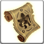

<!-- generated:start -->
<!-- generated-keys: title=940789 type=6143a1 id=e9a20a sources=bb1e1c name_key=d748c2 duration=995f11 is_buff=b6589f stack_type=356a19 group=e9a20a effects=279dee icon=bbdd02 applied_by=264909 -->
|  |  |
|---|---|
|  |  |
| **Buff id** | `1150` |
| **Duration** | 5 min (1,500 ticks of 200 ms; unit from [[gameplay/consumables]]) |
| **Buff / debuff** | flag 0 (is_buff?, guessed column) |
| **Stack type** | 1 (guessed column) |
| **Group** | 1150 (+0x44 category; buffs of one group replace each other?) |
| **Icon** | `ui/icons/Items_07.png` cell 33 |

### Tooltip

> Transformation : Golem

### Effects

Effect codes read as `ItemOption` stat codes (*assumed*: a few rows disagree with their own tooltip, e.g. buff 1 "EXP +15%" uses code 41).

| code | effect | value |
|---|---|---|
| 361 | code 361 (unknown) | 0 |
| 360 | code 360 (unknown) | 613 |
| 302 | code 302 (unknown) | 1,150 |

### Applied by

- Using [[wiki/items/760-scroll-of-transform-golem|Scroll of Transform : (Golem)]] (Item_Base option 301)

### Mentioned in

- [[gameplay/consumables|Consumables and clickables]] § 3. Potions and other clickables (line 89): 760 / 761 / 762 · Scroll of Transform: Golem / Demon / Slime · 1150 / 1152 / 910 · Turn into unit 613 / 741 / 627 · 5 min · 1,000 gold base (kind 19)
<!-- generated:end -->

## Notes

<!-- hand-written: add what you know, with a source -->

## Behaviour

<!-- hand-written: add what you know, with a source -->

## Sources

<!-- hand-written: add what you know, with a source -->

## Open questions

<!-- hand-written: add what you know, with a source -->

<!-- credit:start -->
---
*Game content © GAMESinFLAMES / Joyimpact; reproduced for preservation and reference.*
<!-- credit:end -->
