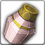

<!-- generated:start -->
<!-- generated-keys: title=63537f type=6143a1 id=584784 sources=211778 name_key=8fe7b9 duration=995f11 is_buff=b6589f stack_type=356a19 group=27b0e6 effects=0cbb78 icon=e023e5 applied_by=389325 -->
|  |  |
|---|---|
|  |  |
| **Buff id** | `2126` |
| **Duration** | 5 min (1,500 ticks of 200 ms; unit from [[gameplay/consumables]]) |
| **Buff / debuff** | flag 0 (is_buff?, guessed column) |
| **Stack type** | 1 (guessed column) |
| **Group** | 2109 (+0x44 category; buffs of one group replace each other?) |
| **Icon** | `ui/icons/Items_03.png` cell 45 |

### Tooltip

> Elixir of Tenacity [B] : Tenacity +20, Life Steal with each attack +6

### Effects

Effect codes read as `ItemOption` stat codes (*assumed*: a few rows disagree with their own tooltip, e.g. buff 1 "EXP +15%" uses code 41).

| code | effect | value |
|---|---|---|
| 41 | Life Steal(%) | 6 |
| 269 | Toughness(%) | 20 |

### Applied by

- Using [[wiki/items/753-elixir-of-tenacity-b|Elixir of Tenacity (B)]] (Item_Base option 301)
<!-- generated:end -->

## Notes

<!-- hand-written: add what you know, with a source -->

## Behaviour

<!-- hand-written: add what you know, with a source -->

## Sources

<!-- hand-written: add what you know, with a source -->

## Open questions

<!-- hand-written: add what you know, with a source -->

<!-- credit:start -->
---
*Game content © GAMESinFLAMES / Joyimpact; reproduced for preservation and reference.*
<!-- credit:end -->
