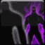

<!-- generated:start -->
<!-- generated-keys: title=a0e62f type=6143a1 id=426cc0 sources=57b4d8 name_key=98b941 duration=6c749d is_buff=b6589f stack_type=356a19 group=490a2b effects=7823fa icon=67ccf4 applied_by=dc08de -->
|  |  |
|---|---|
|  |  |
| **Buff id** | `30023` |
| **Duration** | 10 s (50 ticks of 200 ms; unit from [[gameplay/consumables]]) |
| **Buff / debuff** | flag 0 (is_buff?, guessed column) |
| **Stack type** | 1 (guessed column) |
| **Group** | 10023 (+0x44 category; buffs of one group replace each other?) |
| **Icon** | `ui/icons/Skill_Miriam_01.png` cell 17 |

### Tooltip

> Shadow Walk: Creates a shield that absorbs Damage for 10 seconds.

### Effects

Effect codes read as `ItemOption` stat codes (*assumed*: a few rows disagree with their own tooltip, e.g. buff 1 "EXP +15%" uses code 41).

| code | effect | value |
|---|---|---|
| 441 | code 441 (unknown) | 350 |
| 101 | Attack(%) | 10 |

### Applied by

- Skill [[wiki/skills/10027-shadow-walk|Shadow Walk]], effect slot 1 (type 317, rate 100%)
<!-- generated:end -->

## Notes

<!-- hand-written: add what you know, with a source -->

## Behaviour

<!-- hand-written: add what you know, with a source -->

## Sources

<!-- hand-written: add what you know, with a source -->

## Open questions

<!-- hand-written: add what you know, with a source -->

<!-- credit:start -->
---
*Game content © GAMESinFLAMES / Joyimpact; reproduced for preservation and reference.*
<!-- credit:end -->
