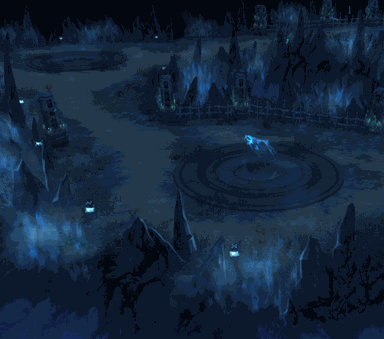

<!-- generated:start -->
<!-- generated-keys: title=5cdb46 type=3e3f38 id=8bd795 sources=e3dda6 field=8bd795 max_users=ac3478 level=356a19 entry_cost=3510f5 event=7cb6ef shown_rewards=e8b4f2 c17=2e8c02 image=d7b848 dungeon_slots=068b5b boss=69effa gear_tier=13930c gathering=42ca89 time_limit_s=2be88c -->
|  |  |
|---|---|
|  |  |
| **Field** | [[wiki/fields/121-lv-1-skull-temple\|(Lv 1) Skull Temple (field 121)]] |
| **Level** | 1 |
| **Gear tier dropped** | T1 (guides) |
| **Max players** | 5 (SceneList; guides: max 5 per portal) |
| **Event dungeon** | no |
| **Banner** | `UI/FieldImages/1.png` |
| **c17 (unknown)** | 2002 |

### Entry cost

| mode | ticket | count |
|---|---|---|
| normal | [[wiki/items/688-dimensional-energy\|Dimensional energy]] | 3 |
| hard | [[wiki/items/688-dimensional-energy\|Dimensional energy]] | 3 |

`DungeonAdmission` has two {item, count} pairs; reading them as normal / hard mode follows the guides' tables (*inferred*). The 2018 guide numbers differ: [[gameplay/maps-and-dungeons#Entry cost (Dimensional Energy, item 688)|Maps and dungeons § Entry cost]].

### Boss

- [[wiki/monsters/672-king-deathhead|King Deathhead]] (main)
- [[wiki/monsters/804-tough-king-deathhead|Tough King Deathhead]] (other id in the guides' list; *client* variant)

### Rewards shown on the entry panel

What the dungeon window advertises; not a drop table and no rates (*client*). Drop rates go on the monster pages.

[[wiki/items/601-blue-passion-fragments-d|Blue Passion Fragments (D)]], [[wiki/items/693-gem-stone-blue|Gem Stone : Blue]], [[wiki/items/1930-essence-of-darkness|essence of Darkness]], [[wiki/items/2701-deathhead-horn|DeathHead Horn]], [[wiki/items/2751-the-death-head-s-sealed-weapon|The Death Head's Sealed Weapon]]

### Gathering

Nodes placed by `Trigger.cdb` give: [[wiki/items/802-garnet|Garnet]], [[wiki/items/812-red-bloodstone|Red bloodstone]]. Positions on the [[wiki/fields/121-lv-1-skull-temple|field page]].

### Dungeon groups

`Dungeon.cdb` has 3 groups of 15 slots. A slot probably is the tier step a land gets from its distance to the nation's nearest fort (*guess*, from [[gameplay/maps-and-dungeons#Where dungeons appear|Maps and dungeons § Where dungeons appear]]).

Here: group 0 slot 3, group 1 slot 3, group 2 slot 2, group 2 slot 3

### Rules from the guides

Respawn (solo: none; party: about every minute), party loot and the hard-mode rules are in [[gameplay/maps-and-dungeons#Respawn and party rules inside dungeons|Maps and dungeons § Respawn and party rules]]. Materials per run: [[gameplay/dungeon-drops|Dungeon drops]].
<!-- generated:end -->

## Notes

<!-- hand-written: add what you know, with a source -->

## Behaviour

<!-- hand-written: add what you know, with a source -->

## Sources

<!-- hand-written: add what you know, with a source -->

## Open questions

<!-- hand-written: add what you know, with a source -->

<!-- credit:start -->
---
*Game content © GAMESinFLAMES / Joyimpact; reproduced for preservation and reference.*
<!-- credit:end -->
