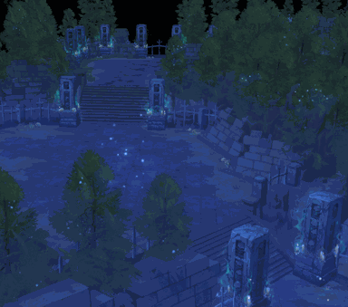

<!-- generated:start -->
<!-- generated-keys: title=006667 type=3e3f38 id=b4182b sources=cb6130 field=b4182b max_users=ac3478 level=da4b92 entry_cost=3354a5 event=7cb6ef shown_rewards=ee6072 c17=ab165c image=d3bc8e dungeon_slots=079694 boss=0c12c5 gear_tier=13930c gathering=83d28e time_limit_s=2be88c -->
|  |  |
|---|---|
|  |  |
| **Field** | [[wiki/fields/128-lv-2-skull-cemetery\|(Lv 2) Skull Cemetery (field 128)]] |
| **Level** | 2 |
| **Gear tier dropped** | T1 (guides) |
| **Max players** | 5 (SceneList; guides: max 5 per portal) |
| **Event dungeon** | no |
| **Banner** | `UI/FieldImages/2.png` |
| **c17 (unknown)** | 2003 |

### Entry cost

| mode | ticket | count |
|---|---|---|
| normal | [[wiki/items/688-dimensional-energy\|Dimensional energy]] | 3 |
| hard | [[wiki/items/688-dimensional-energy\|Dimensional energy]] | 5 |

`DungeonAdmission` has two {item, count} pairs; reading them as normal / hard mode follows the guides' tables (*inferred*). The 2018 guide numbers differ: [[gameplay/maps-and-dungeons#Entry cost (Dimensional Energy, item 688)|Maps and dungeons § Entry cost]].

### Boss

- [[wiki/monsters/673-dark-knight-skull|Dark Knight Skull]] (main)
- [[wiki/monsters/809-dark-knight-skull|Dark Knight Skull]] (other id in the guides' list; *client* variant)
- [[wiki/monsters/1205-dark-knight-skull|Dark Knight Skull]] (other id in the guides' list; *client* variant)

### Rewards shown on the entry panel

What the dungeon window advertises; not a drop table and no rates (*client*). Drop rates go on the monster pages.

[[wiki/items/611-red-passion-fragments-d|Red Passion Fragments (D)]], [[wiki/items/693-gem-stone-blue|Gem Stone : Blue]], [[wiki/items/1930-essence-of-darkness|essence of Darkness]], [[wiki/items/2702-skull-horn|Skull Horn]], [[wiki/items/2752-the-dark-knight-s-sealed-weapon|The Dark Knight.'s Sealed Weapon]]

### Gathering

Nodes placed by `Trigger.cdb` give: [[wiki/items/814-topaz|Topaz]], [[wiki/items/804-blue-bloodstone|Blue bloodstone]], [[wiki/items/822-rosemary|Rosemary]], [[wiki/items/824-jasmine|Jasmine]]. Positions on the [[wiki/fields/128-lv-2-skull-cemetery|field page]].

### Dungeon groups

`Dungeon.cdb` has 3 groups of 15 slots. A slot probably is the tier step a land gets from its distance to the nation's nearest fort (*guess*, from [[gameplay/maps-and-dungeons#Where dungeons appear|Maps and dungeons § Where dungeons appear]]).

Here: group 0 slot 4, group 1 slot 4, group 2 slot 4

### Rules from the guides

Respawn (solo: none; party: about every minute), party loot and the hard-mode rules are in [[gameplay/maps-and-dungeons#Respawn and party rules inside dungeons|Maps and dungeons § Respawn and party rules]]. Materials per run: [[gameplay/dungeon-drops|Dungeon drops]].
<!-- generated:end -->

## Notes

- Boss: [[wiki/monsters/673-dark-knight-skull|Dark Knight Skull 673]] / [[wiki/monsters/809-dark-knight-skull|809]] / [[wiki/monsters/1205-dark-knight-skull|1205]] ([[wiki/monsters/1504-dark-knight-skull|1504]] also listed by [[gameplay/dungeon-drops]]) (guides + client ids, [[gameplay/maps-and-dungeons]] §2 and [[gameplay/dungeon-drops]] §1).
- Crush Online name: Cemetery of the Skull (Lv 2), boss called "Death Knight" (sheet / forum, [[gameplay/dungeon-drops]] §1, [[gameplay/crush-mechanics]] §9).
- Materials named by the 2018 dungeons guide: Blue Bloodstone, Topaz, Rosemary and Jasmine ×2 each (guide, [[gameplay/maps-and-dungeons]] §2). The gathering list in the front matter comes from the client's `Trigger` table.
- Gear: drops T1 named-set gear, already reinforced at a random level (seen +0 to +11). Sets seen in this dungeon: Honor armor/shoes, Life gloves/shoes/necklace/belt, Transcendency necklace/bracelet, Barrier belt. The guide's author says 2–3 rarer drops are missing from the list (image + guide, [[gameplay/maps-and-dungeons]] §2).
- Map (from the guide's minimap): entry bottom-left, a loop of chambers, marker on the far east, a large square room bottom-right (image, [[gameplay/maps-and-dungeons]] §2).
- Unlocks at character level 21 (Warmonger patch 0615, [[gameplay/patch-history]] § Dungeons and world).
- The Crush Online summon scroll for this boss survives in the client as [[wiki/items/2586-the-dark-knight-s-pipe|The Dark Knight's Pipe]] (client, [[gameplay/crush-patch-notes]] § 2016-12-15).
- Forum: the Lv 1–2 bosses (Deathhead, Death Knight) could be soloed with base gear and potions; T1/T2 bosses were shielded unless the nation held more than one fort on the channel (forum, [[gameplay/warmonger-forum]] §3). Essence of Darkness "drops from the Tier 1 dungeon boss" (Crush forum, [[gameplay/dungeon-drops]] §1).

## Behaviour

- Hard mode has more and stronger monsters, better loot and a boss at the end; normal mode is easy (guide, [[gameplay/maps-and-dungeons]] §2).
- Respawn: solo, monsters do not respawn; with 2+ party members in hard mode they do. Guides give the first refill after 3–5 min (3 players) then about every minute, or after 9 min / when the timer shows 10:00 (guides, [[gameplay/maps-and-dungeons]] §2). Warmonger patch 0404: with more than 2 users monsters respawn after 5 min (notes, [[gameplay/patch-history]] § Dungeons and world).
- Time limit: Warmonger patch 0402 cut the dungeon open time from 20 to 15 min (notes, [[gameplay/patch-history]]); in Crush Online, when the timer ran out nothing dropped and the party was teleported out (staff, [[gameplay/crush-mechanics]] §9).
- Loot: in March 2018 only the last hitter got loot; later every living party member who damaged the monster got a drop, and a party raised the drop rate (guides, [[gameplay/maps-and-dungeons]] §2). Crush Online scaled monster count and loot with party size; a solo player got about 1/5 of a full group's loot (player, [[gameplay/crush-mechanics]] §9).
- Max 5 players per portal instance; with "Can not enter" ticked nobody else can join (guide, [[gameplay/maps-and-dungeons]] §1).
- The dungeon tier a land shows depends on its distance from the nation's main fort (guides, [[gameplay/maps-and-dungeons]] §1; [[gameplay/patch-history]] WM 0726).
- In Crush Online (patch 2016-12-15) the dungeon elites dropped a scroll that summoned one extra boss, once per boss (staff, [[gameplay/crush-patch-notes]] § 2016-12-15). The forum says the dungeon boss only exists while the land is monster-invaded (forum, [[gameplay/warmonger-forum]] §3).

## Sources

- [[gameplay/maps-and-dungeons]] §1–2, [[gameplay/dungeon-drops]] §1–2, [[gameplay/patch-history]] § Dungeons and world, [[gameplay/crush-mechanics]] §9 and §12, [[gameplay/crush-patch-notes]] § 2016-12-15, [[gameplay/warmonger-forum]] §3

## Open questions

- Entry cost: the client's `DungeonAdmission` (front matter) asks 3 / 5 Dimensional Energy (normal / hard). The 2018 guide table and Warmonger patch 0726 give 3 / 8, and the spring-2018 UI showed hard = 3 + 1 bronze Time Energy (guides + image, [[gameplay/maps-and-dungeons]] §2; [[gameplay/patch-history]]). The client (final build) is used; the guide numbers are history.
- `time_limit_s` 900 assumes the "dungeon open time" of Warmonger patch 0402 is the instance timer (the Crush Online timer was 20:00, [[gameplay/video-dungeon-run]] §5). No source shows the Warmonger timer on screen.
- The guides do not say which of the boss's unit ids is the normal-mode, hard-mode or field version.

<!-- credit:start -->
---
*Game content © GAMESinFLAMES / Joyimpact; reproduced for preservation and reference.*
<!-- credit:end -->
