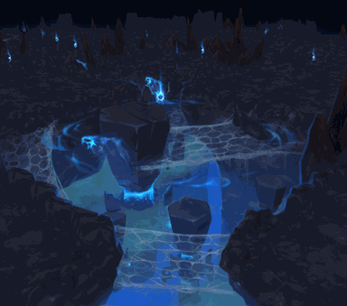

<!-- generated:start -->
<!-- generated-keys: title=a78e33 type=3e3f38 id=91dfde sources=8c38e5 field=91dfde max_users=310b86 entry_cost=6d13a2 event=5ffe53 shown_rewards=d76fc0 c17=32a70a image=511ace notice_key=4817ae schedule=c6cf6c boss=97d170 time_limit_s=1d5529 -->
|  |  |
|---|---|
|  |  |
| **Field** | [[wiki/fields/132-death-s-rest-passion\|Death's Rest (Passion) (field 132)]] |
| **Max players** | 100 (SceneList) |
| **Event dungeon** | yes |
| **Time limit** | 180 min |
| **Panel notice** | Time limit : 3 hours (`GUI_FieldIDX_132`) |
| **Banner** | `UI/FieldImages/51.png` |
| **c17 (unknown)** | 2011 |

### Entry cost

| mode | ticket | count |
|---|---|---|
| normal | [[wiki/items/688-dimensional-energy\|Dimensional energy]] | 2 |
| hard | [[wiki/items/688-dimensional-energy\|Dimensional energy]] | 2 |

`DungeonAdmission` has two {item, count} pairs; reading them as normal / hard mode follows the guides' tables (*inferred*). The 2018 guide numbers differ: [[gameplay/maps-and-dungeons#Entry cost (Dimensional Energy, item 688)|Maps and dungeons § Entry cost]].

### Boss

Not known. Add `boss:` (UnitDB ids) with a source.

### Rewards shown on the entry panel

What the dungeon window advertises; not a drop table and no rates (*client*). Drop rates go on the monster pages.

[[wiki/items/601-blue-passion-fragments-d|Blue Passion Fragments (D)]], [[wiki/items/611-red-passion-fragments-d|Red Passion Fragments (D)]], [[wiki/items/602-blue-passion-piece-d|Blue Passion Piece (D)]], [[wiki/items/612-red-passion-piece-d|Red Passion Piece (D)]], [[wiki/items/700-crystal-blue|Crystal : Blue]], [[wiki/items/693-gem-stone-blue|Gem Stone : Blue]]

### Event schedule

`Event_Dungeon` rows. The `hour` value is the number the world map's event list shows ([[gameplay/video-dungeon-run#6. Event dungeon list (world map, Dungeon tab)|Nas Village run §6]]); what it means is not known.

| hour? | open (min) | row field | c2 | c3 | c4 |
|---|---|---|---|---|---|
| 12 | 180 | 127 | 1 | 4 | 4 |

### Rules from the guides

Respawn (solo: none; party: about every minute), party loot and the hard-mode rules are in [[gameplay/maps-and-dungeons#Respawn and party rules inside dungeons|Maps and dungeons § Respawn and party rules]]. Materials per run: [[gameplay/dungeon-drops|Dungeon drops]].

### Mentioned in

- [[gameplay/events-and-schedules#9. Other timers and limits|Events, schedules and PvP rewards § 9. Other timers and limits]]
- [[gameplay/maps-and-dungeons#3. Event / special dungeons|Maps and dungeons § 3. Event / special dungeons]]
- [[gameplay/patch-history#Dungeons and world|Patch notes and other sources § Dungeons and world]]
<!-- generated:end -->

## Notes

<!-- hand-written: add what you know, with a source -->

## Behaviour

<!-- hand-written: add what you know, with a source -->

## Sources

<!-- hand-written: add what you know, with a source -->

## Open questions

<!-- hand-written: add what you know, with a source -->

<!-- credit:start -->
---
*Game content © GAMESinFLAMES / Joyimpact; reproduced for preservation and reference.*
<!-- credit:end -->
