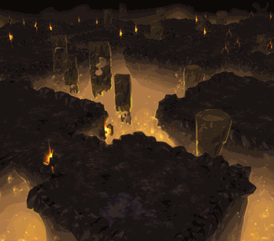

<!-- generated:start -->
<!-- generated-keys: title=7f851f type=3e3f38 id=d30f79 sources=46748f field=d30f79 max_users=310b86 entry_cost=70723b event=5ffe53 shown_rewards=f62141 c17=084b3a image=34756c notice_key=87226b schedule=803f37 boss=97d170 time_limit_s=1d5529 -->
|  |  |
|---|---|
|  |  |
| **Field** | [[wiki/fields/133-sinking-nest-crystal\|Sinking Nest (Crystal) (field 133)]] |
| **Max players** | 100 (SceneList) |
| **Event dungeon** | yes |
| **Time limit** | 180 min |
| **Panel notice** | Time limit : 3 hours (`GUI_FieldIDX_133`) |
| **Banner** | `UI/FieldImages/52.png` |
| **c17 (unknown)** | 2012 |

### Entry cost

| mode | ticket | count |
|---|---|---|
| normal | [[wiki/items/688-dimensional-energy\|Dimensional energy]] | 4 |
| hard | [[wiki/items/688-dimensional-energy\|Dimensional energy]] | 4 |

`DungeonAdmission` has two {item, count} pairs; reading them as normal / hard mode follows the guides' tables (*inferred*). The 2018 guide numbers differ: [[gameplay/maps-and-dungeons#Entry cost (Dimensional Energy, item 688)|Maps and dungeons § Entry cost]].

### Boss

Not known. Add `boss:` (UnitDB ids) with a source.

### Rewards shown on the entry panel

What the dungeon window advertises; not a drop table and no rates (*client*). Drop rates go on the monster pages.

[[wiki/items/700-crystal-blue|Crystal : Blue]], [[wiki/items/701-crystal-yellow|Crystal : Yellow]], [[wiki/items/702-crystal-red|Crystal : Red]], [[wiki/items/693-gem-stone-blue|Gem Stone : Blue]], [[wiki/items/694-gem-stone-yellow|Gem Stone : Yellow]], [[wiki/items/695-gem-stone-red|Gem Stone : Red]]

### Event schedule

`Event_Dungeon` rows. The `hour` value is the number the world map's event list shows ([[gameplay/video-dungeon-run#6. Event dungeon list (world map, Dungeon tab)|Nas Village run §6]]); what it means is not known.

| hour? | open (min) | row field | c2 | c3 | c4 |
|---|---|---|---|---|---|
| 12 | 180 | 127 | 1 | 4 | 2 |

### Rules from the guides

Respawn (solo: none; party: about every minute), party loot and the hard-mode rules are in [[gameplay/maps-and-dungeons#Respawn and party rules inside dungeons|Maps and dungeons § Respawn and party rules]]. Materials per run: [[gameplay/dungeon-drops|Dungeon drops]].

### Mentioned in

- [[gameplay/patch-history#Dungeons and world|Patch notes and other sources § Dungeons and world]]
- [[gameplay/server-rules#Added from the Warmonger forum and videos (round 2)|Server rules checklist § Added from the Warmonger forum and videos (round 2)]]
- [[gameplay/video-dungeon-run#2. Pack positions (field 133)|Video notes: Nas Village dungeon run (ZonderCoRe) § 2. Pack positions (field 133)]]
<!-- generated:end -->

## Notes

- This is the event dungeon the guides call **Nas Village (Entrance)**: its `DungeonAdmission` row advertises Crystal Blue/Yellow/Red (700–702) and Gem Stone Blue/Yellow/Red (693–695), exactly what a June 2018 Nas Village run drops, and the world-map list ties 134/135 to other dungeons (client + *guess*, [[gameplay/video-dungeon-run]] §1, §6).
- Warmonger patch 0124 refocused Sinking Nest on crystals and gemstones with a 3-hour limit (was unlimited), matching the client's entry-panel text (notes, [[gameplay/patch-history]] § Dungeons and world; [[gameplay/events-and-schedules]] §9). It is one tab of the "Mysterious World" border area reached through the fortress gate (WM 0110).
- Guides: Nas Village appears on Skywing Yard and Sunstone gateway; "the best place for crystals" and for gold, because its Faded Passion Pattern drops sell well (guides, [[gameplay/maps-and-dungeons]] §3).
- The run was entered from a stone portal ring at about (4452, 1070) in [[wiki/fields/57-raging-wind|Raging Wind (57)]]; inside, the entry/exit point is (1332.13, 2866.99), `Teleport_List` gate 1200, and the map geometry is ZoneDB 126 (video + client, [[gameplay/video-dungeon-run]] §1).

Pack stops on every lap of a 3-player hard-mode run (video, ±4 units, [[gameplay/video-dungeon-run]] §2): about 5–7 monsters each, warriors with shields and bow archers. The client's Nas units are [[wiki/monsters/688-nas-warrior|688]], [[wiki/monsters/689-nas-archer|689]], [[wiki/monsters/690-elite-nas-warrior|690]], [[wiki/monsters/691-elite-nas-archer|691]], [[wiki/monsters/1219-superior-nas-warrior|1219]] and [[wiki/monsters/1220-superior-nas-archer|1220]]; which of them spawn here is a *guess*.

| # | x | z | Note |
|---|---|---|---|
| 1 | 1352–1372 | 2884–2890 | first chamber; the party waits here for respawns |
| 2 | 1377–1388 | 2890–2897 | |
| 3 | 1408–1419 | 2908–2915 | |
| 4 | 1449–1458 | 2929–2935 | long fights |
| 5 | 1460–1467 | 2938–2942 | |
| 6 | 1478–1482 | 2951–2958 | dead end, last pack |

- Loot seen by one player (video, [[gameplay/video-dungeon-run]] §4): Faded Passion fragments (1900) ×1/3/10/20 on most kills, Faded Passion Piece (1901) ×10/20, Faded Passion Pattern (1902) ×10/20, Crystal Blue/Yellow/Red/Black (700–703) ×1–6, once a Medal: Bronze (1000). Drops go straight to the bag. No gear, essence, horn or sealed weapon in 11 minutes.

## Behaviour

- No boss appeared in the hard-mode run: the party cleared the same six packs until "Dungeon finished / Exiting the dungeon initiated" at [11:29](https://www.youtube.com/watch?v=eL5hx5C9iZw&t=689s), about 11 min 13 s after entry (video, [[gameplay/video-dungeon-run]] §3).
- With 3 players a cleared pack was back after about 90–100 s; one lap took about 95–105 s (video, [[gameplay/video-dungeon-run]] §3).
- Event dungeons pop up on random lands of either nation on a schedule; the world map's Dungeon tab lists the active ones and the land they are on (guides, [[gameplay/maps-and-dungeons]] §3).

## Sources

- [[gameplay/video-dungeon-run]] §1–4, §6; [[gameplay/patch-history]] § Dungeons and world; [[gameplay/events-and-schedules]] §9; [[gameplay/maps-and-dungeons]] §2–3

## Open questions

- Entry cost: client 4 / 4 Dimensional Energy (normal / hard); the 2018 guide table gives 5 / 10 for Nas Village ([[gameplay/maps-and-dungeons]] §2; [[gameplay/video-dungeon-run]] §1). The client value is used.
- Why the run ended after about 11 min while the limit is 3 h is unknown (an event window ending is a *guess*, [[gameplay/video-dungeon-run]] §3).
- `boss` stays empty: no source shows a boss here, and the shape has no way to say "none".

<!-- credit:start -->
---
*Game content © GAMESinFLAMES / Joyimpact; reproduced for preservation and reference.*
<!-- credit:end -->
