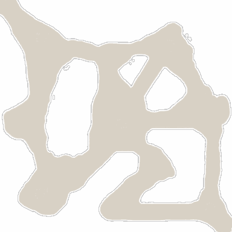

<!-- generated:start -->
<!-- generated-keys: title=1d0a2e type=7a94db id=b1d578 sources=3e4c78 name_key=2ace1a kind=8e3535 scene_type=da4b92 max_users=22d200 group=ac3478 scene_c4=da4b92 neighbours=62780b zones=1aa8c1 segments=3b3df4 worldmap_rect=ea337e gates=fbd534 connections=272a22 npcs=97d170 monsters=97d170 spawn_points=97d170 -->
|  |  |
|---|---|
|  |  |
| **Field id** | `10` |
| **Kind** | land (SceneList type 2; name *inferred*) |
| **Max users** | 30 (SceneList, column meaning *guessed*) |
| **Region group** | 5 (SceneList last column) |
| **Zones** | [[wiki/zones/37-field-10-shaking-earth\|Field 10 (Shaking Earth)]] |
| **Terrain segments** | `ZP10_02` |
| **World-map rectangle** | `[910, 249, 973, 297]` (WorldmapData, panel pixels) |
| **Name key** | `FieldName_10` |

A land of Gaia. Who owns it (Arslan, Erion, Armia or monsters) changes in play and is server state; see [[gameplay/maps-and-dungeons|Maps and dungeons]] §1 and §4.

### Gates and connections

`Teleport_List` rows of this field. A player sent to a gate id arrives at that gate's position (`server/travel.py`); the gate's own trigger is the portal object a little further out (*client*).

| gate | at (x, z) | leads to | arrives at gate | label |
|---|---|---|---|---|
| 172 | 2619.17, 709.71 | [[wiki/fields/7-moonshadow-wood\|Moonshadow Wood]] | 200 | FieldName_10 |
| 260 | 2736.57, 593.3 | [[wiki/fields/16-refuge-of-old-dragon\|Refuge of old dragon]] | 201 | FieldName_10 |

Entered from: [[wiki/fields/7-moonshadow-wood|Moonshadow Wood]] (gate 200 → 172), [[wiki/fields/16-refuge-of-old-dragon|Refuge of old dragon]] (gate 201 → 260)

Neighbouring lands (`SceneList` link columns): [[wiki/fields/7-moonshadow-wood|Moonshadow Wood]], [[wiki/fields/16-refuge-of-old-dragon|Refuge of old dragon]]

### NPCs

None known yet.

### Monsters

None known yet.

### Spawn points

Monster spawn positions are not in the client data (`map.jpk` has no spawn files; [[spec/monsters|Monsters]]). Add them to the monster's page (`spawns:` with `field`, `x`, `z`) or here as `spawn_points:` (`unit`, `x`, `z`, `count`, `radius`, `respawn_s`).

### Navmesh

Segments covered by this field's zones (256 × 256 units each). Check a point with `tools/navmesh.py check x z` ([[spec/navmesh|Navmesh]]).

| segment | navmesh (.nav) | terrain (.zp) |
|---|---|---|
| ZP10_02 | yes | yes |
<!-- generated:end -->

## Notes

<!-- hand-written: add what you know, with a source -->

## Behaviour

<!-- hand-written: add what you know, with a source -->

## Sources

<!-- hand-written: add what you know, with a source -->

## Open questions

<!-- hand-written: add what you know, with a source -->

<!-- credit:start -->
---
*Game content © GAMESinFLAMES / Joyimpact; reproduced for preservation and reference.*
<!-- credit:end -->
