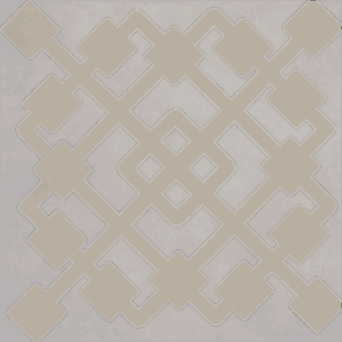

<!-- generated:start -->
<!-- generated-keys: title=c2a1e0 type=7a94db id=dbc0f0 sources=490220 name_key=12debd kind=7a94db scene_type=ac3478 max_users=310b86 group=7b5200 neighbours=0136f1 nation=b0e09b nation_copies=5497e0 zones=6d958c segments=2808b5 gates=efe605 connections=b67557 npcs=97d170 monsters=2f4123 spawn_points=97d170 triggers=f9c91d -->
|  |  |
|---|---|
|  |  |
| **Field id** | `101` |
| **Kind** | field (SceneList type 5; name *inferred*) |
| **Max users** | 100 (SceneList, column meaning *guessed*) |
| **Region group** | 12 (SceneList last column) |
| **Nation** | Armia |
| **Nation copies** | Arslan [[wiki/fields/99-corpse-incineration\|Arslan (99)]], Erion [[wiki/fields/100-corpse-incineration\|Erion (100)]], Armia **101** |
| **Zones** | [[wiki/zones/111-abyss-lv1-101-corpse-incineration\|Abyss LV1 101 (Corpse incineration)]] |
| **Terrain segments** | `ZP03_08` |
| **Name key** | `FieldName_101` |

### Gates and connections

`Teleport_List` rows of this field. A player sent to a gate id arrives at that gate's position (`server/travel.py`); the gate's own trigger is the portal object a little further out (*client*).

| gate | at (x, z) | leads to | arrives at gate | label |
|---|---|---|---|---|
| 1502 | 973.31, 2254.92 | [[wiki/fields/96-training-camp\|Training Camp]] | 1502 | FieldName_101 |

Entered from: [[wiki/fields/96-training-camp|Training Camp]] (gate 1505 → 1505)

Neighbouring lands (`SceneList` link columns): [[wiki/fields/106-the-avenue-of-spirit|The avenue of spirit]], [[wiki/fields/107-place-for-scattered-troops|Place for Scattered troops]]

### NPCs

None known yet.

### Monsters

| monster | unit | why it is listed |
|---|---|---|
| [[wiki/monsters/700-skeleton-warrior\|Skeleton Warrior]] | 700 | kill objective of quest [[wiki/quests/101-all-sorts-of-fragile-bones\|101]] (kill group 10003, UnitDB i32@80); monster page (`spawns` / `spawn_fields`) |
| [[wiki/monsters/701-skeleton-archer\|Skeleton Archer]] | 701 | kill objective of quest [[wiki/quests/101-all-sorts-of-fragile-bones\|101]] (kill group 10003, UnitDB i32@80); monster page (`spawns` / `spawn_fields`) |
| [[wiki/monsters/702-elite-skeleton-warrior\|Elite Skeleton Warrior]] | 702 | kill objective of quest [[wiki/quests/101-all-sorts-of-fragile-bones\|101]] (kill group 10004, UnitDB i32@80); monster page (`spawns` / `spawn_fields`) |
| [[wiki/monsters/703-elite-skeleton-archer\|Elite Skeleton Archer]] | 703 | kill objective of quest [[wiki/quests/101-all-sorts-of-fragile-bones\|101]] (kill group 10004, UnitDB i32@80); monster page (`spawns` / `spawn_fields`) |
| [[wiki/monsters/704-skeleton-warrior-officer\|Skeleton Warrior Officer]] | 704 | kill objective of quest [[wiki/quests/10-find-the-secret-document\|10]], [[wiki/quests/107-hunting-skeletons\|107]]; monster page (`spawns` / `spawn_fields`) |
| [[wiki/monsters/705-skeleton-archer-officer\|Skeleton Archer Officer]] | 705 | kill objective of quest [[wiki/quests/107-hunting-skeletons\|107]]; monster page (`spawns` / `spawn_fields`) |
| unit 10003 (not in UnitDB) | 10003 | hand-entered |
| unit 10004 (not in UnitDB) | 10004 | hand-entered |

### Spawn points

Monster spawn positions are not in the client data (`map.jpk` has no spawn files; [[spec/monsters|Monsters]]). Add them to the monster's page (`spawns:` with `field`, `x`, `z`) or here as `spawn_points:` (`unit`, `x`, `z`, `count`, `radius`, `respawn_s`).

### Client-placed objects (`Trigger`)

Talk devices (shape 4) and gathering nodes (type 0, shape 5: the item is what gathering gives). The server can load these as they are; the video check in [[gameplay/video-dungeon-run|Nas Village dungeon run]] §5 matched them within 5 units.

| trigger | kind | name | gives | at (x, z) | type | model |
|---|---|---|---|---|---|---|
| [[wiki/nodes/10101-scout\|10101]] | talk/device | Scout |  | 979.52, 2098.32 | 1 | 178 |

### Quests in this field

[[wiki/quests/10-find-the-secret-document|Find the Secret Document]], [[wiki/quests/107-hunting-skeletons|Hunting Skeletons]]

### Navmesh

Segments covered by this field's zones (256 × 256 units each). Check a point with `tools/navmesh.py check x z` ([[spec/navmesh|Navmesh]]).

| segment | navmesh (.nav) | terrain (.zp) |
|---|---|---|
| ZP03_08 | yes | yes |

### Mentioned in

- [[gameplay/server-rules#Added from the source hunt (see ((gameplay/sources/Sources and gaps)))|Server rules checklist § Added from the source hunt (see ((gameplay/sources/Sources and gaps)))]]
- [[gameplay/abyss-map|Abyss map and portal graph]] (by name)
- [[gameplay/maps-and-dungeons|Maps and dungeons]] (by name)
- [[gameplay/npc-locations|NPC and point-of-interest locations]] (by name)
- [[gameplay/sources|Sources and gaps]] (by name)
- [[gameplay/video-character-creation-and-tutorial|Video notes: character creation and tutorial (ZonderCoRe, June 2018)]] (by name)
- [[gameplay/video-early-quests|Video notes: first session, levels 1+ (charmanmugen)]] (by name)
- [[gameplay/video-tutorial-walkthrough|Video notes: tutorial walkthrough (Bravely Forward 2)]] (by name)
<!-- generated:end -->

## Notes

- Abyss level 1, Armia entrance: entered from Training Camp 96 (gate 1505); the exit 1502 sits top-right at (973.31, 2254.92) ([[gameplay/abyss-map|Abyss map]]). *client*
- Bottom-left portal at about (823, 2103) leads to field 106 (top-left, about (1330, 2494)); no gate id is known for it. Armia route down: 101 → 106 → 109 → 113 → 114 ([[gameplay/abyss-map|Abyss map]]). *image*
- Abyss rules from the 2018 patches: lower drop rate, kills do not count for the daily kill quest, 5 s immunity after moving, and later a non-PK area ([[gameplay/patch-history|Patch history]], WM 0329/0404/0511). The ES guide says Abyss monsters stop giving loot at level 30 ([[gameplay/maps-and-dungeons|Maps and dungeons]] §1). *guide*

## Behaviour

<!-- hand-written: add what you know, with a source -->

## Sources

- [[gameplay/abyss-map|Abyss map]], [[gameplay/patch-history|Patch history]].

## Open questions

<!-- hand-written: add what you know, with a source -->

<!-- credit:start -->
---
*Game content © GAMESinFLAMES / Joyimpact; reproduced for preservation and reference.*
<!-- credit:end -->
