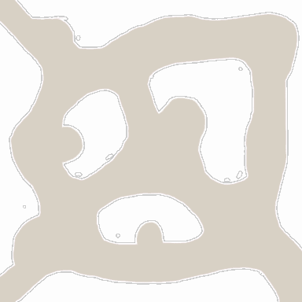

<!-- generated:start -->
<!-- generated-keys: title=0c1089 type=7a94db id=7b5200 sources=13d63c name_key=f5e1ed kind=8e3535 scene_type=da4b92 max_users=22d200 group=902ba3 scene_c4=356a19 neighbours=4b56fb zones=49534d segments=f22d3e worldmap_rect=cc097e gates=43ad61 connections=03c9cf npcs=97d170 monsters=97d170 spawn_points=97d170 -->
|  |  |
|---|---|
|  |  |
| **Field id** | `12` |
| **Kind** | land (SceneList type 2; name *inferred*) |
| **Max users** | 30 (SceneList, column meaning *guessed*) |
| **Region group** | 7 (SceneList last column) |
| **Zones** | [[wiki/zones/19-field-12-dark-shore\|Field 12 (Dark Shore)]] |
| **Terrain segments** | `ZP12_02` |
| **World-map rectangle** | `[467, 344, 625, 448]` (WorldmapData, panel pixels) |
| **Name key** | `FieldName_12` |

A land of Gaia. Who owns it (Arslan, Erion, Armia or monsters) changes in play and is server state; see [[gameplay/maps-and-dungeons|Maps and dungeons]] §1 and §4.

### Gates and connections

`Teleport_List` rows of this field. A player sent to a gate id arrives at that gate's position (`server/travel.py`); the gate's own trigger is the portal object a little further out (*client*).

| gate | at (x, z) | leads to | arrives at gate | label |
|---|---|---|---|---|
| 211 | 3132.37, 688.31 | [[wiki/fields/11-punish-canyon\|Punish Canyon]] | 220 | FieldName_12 |
| 230 | 3252.62, 572.53 | [[wiki/fields/13-punish-peak\|Punish Peak]] | 221 | FieldName_12 |
| 270 | 3118.5, 578.53 | [[wiki/fields/17-eternal-river-middle-region\|Eternal River - Middle Region]] | 222 | FieldName_12 |

Entered from: [[wiki/fields/11-punish-canyon|Punish Canyon]] (gate 220 → 211), [[wiki/fields/13-punish-peak|Punish Peak]] (gate 221 → 230), [[wiki/fields/17-eternal-river-middle-region|Eternal River - Middle Region]] (gate 222 → 270)

Neighbouring lands (`SceneList` link columns): [[wiki/fields/11-punish-canyon|Punish Canyon]], [[wiki/fields/13-punish-peak|Punish Peak]], [[wiki/fields/17-eternal-river-middle-region|Eternal River - Middle Region]]

### NPCs

None known yet.

### Monsters

None known yet.

### Spawn points

Monster spawn positions are not in the client data (`map.jpk` has no spawn files; [[spec/monsters|Monsters]]). Add them to the monster's page (`spawns:` with `field`, `x`, `z`) or here as `spawn_points:` (`unit`, `x`, `z`, `count`, `radius`, `respawn_s`).

### Navmesh

Segments covered by this field's zones (256 × 256 units each). Check a point with `tools/navmesh.py check x z` ([[spec/navmesh|Navmesh]]).

| segment | navmesh (.nav) | terrain (.zp) |
|---|---|---|
| ZP12_02 | yes | yes |

### Mentioned in

- [[gameplay/lords-of-the-land|Lords of the Land buff and quest]] (by name)
<!-- generated:end -->

## Notes

- On the October 2016 Crush world map (Erion's view) this land was in the brown NPC-held block on the west ([[gameplay/lords-of-the-land|Lords of the Land]] §6). *image*

## Behaviour

<!-- hand-written: add what you know, with a source -->

## Sources

<!-- hand-written: add what you know, with a source -->

## Open questions

<!-- hand-written: add what you know, with a source -->

<!-- credit:start -->
---
*Game content © GAMESinFLAMES / Joyimpact; reproduced for preservation and reference.*
<!-- credit:end -->
