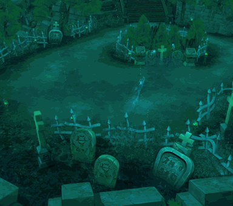

<!-- generated:start -->
<!-- generated-keys: title=6a2ed2 type=7a94db id=f38cfe sources=e009f9 name_key=81700b kind=3e3f38 scene_type=77de68 max_users=ac3478 group=fc074d zones=3833c5 segments=8cb1a9 gates=4396bf connections=401abf npcs=97d170 monsters=0a5247 spawn_points=97d170 triggers=e14c14 dungeon=f38cfe -->
|  |  |
|---|---|
|  |  |
|  |  |
| **Field id** | `124` |
| **Kind** | dungeon (SceneList type 3; name *inferred*) |
| **Max users** | 5 (SceneList, column meaning *guessed*) |
| **Region group** | 36 (SceneList last column) |
| **Zones** | [[wiki/zones/140-field-dungeon-04-ghost-lv-6-ghost-fortress\|Field dungeon 04(ghost) ((Lv 6) Ghost Fortress)]] |
| **Terrain segments** | `ZP07_07` |
| **Dungeon** | [[wiki/dungeons/124-lv-6-ghost-fortress\|dungeon page]] |
| **Name key** | `FieldName_124` |

### Gates and connections

`Teleport_List` rows of this field. A player sent to a gate id arrives at that gate's position (`server/travel.py`); the gate's own trigger is the portal object a little further out (*client*).

| gate | at (x, z) | leads to | arrives at gate | label |
|---|---|---|---|---|
| 1236 | 1852.28, 1991.14 | entrance / exit (leaving returns you to the field you came from) | 1236 | FieldName_124 |
| 1237 | 1875.62, 1865.92 | portal to gate 1238 in this field | 1238 | FiledPortal |
| 1238 | 1997.81, 1991.8 | portal to gate 1237 in this field | 1237 | FiledPortal |

### NPCs

None known yet.

### Monsters

| monster | unit | why it is listed |
|---|---|---|
| [[wiki/monsters/654-black-ghost\|Black Ghost]] | 654 | kill objective of quest [[wiki/quests/33-ghost-fortress\|33]], [[wiki/quests/778-ghost-soldier\|778]], [[wiki/quests/1027-ghost-fortress-hunting\|1027]] (kill group 10029, UnitDB i32@80); monster page (`spawns` / `spawn_fields`) |
| [[wiki/monsters/655-red-ghost\|Red Ghost]] | 655 | kill objective of quest [[wiki/quests/33-ghost-fortress\|33]], [[wiki/quests/778-ghost-soldier\|778]], [[wiki/quests/1027-ghost-fortress-hunting\|1027]] (kill group 10029, UnitDB i32@80); monster page (`spawns` / `spawn_fields`) |
| [[wiki/monsters/656-elite-black-ghost\|Elite Black Ghost]] | 656 | kill objective of quest [[wiki/quests/778-ghost-soldier\|778]], [[wiki/quests/1027-ghost-fortress-hunting\|1027]] (kill group 10030, UnitDB i32@80); monster page (`spawns` / `spawn_fields`) |
| [[wiki/monsters/657-elite-red-ghost\|Elite Red Ghost]] | 657 | kill objective of quest [[wiki/quests/778-ghost-soldier\|778]], [[wiki/quests/1027-ghost-fortress-hunting\|1027]] (kill group 10030, UnitDB i32@80); monster page (`spawns` / `spawn_fields`) |
| [[wiki/monsters/676-great-summoner-spectre\|Great Summoner Spectre]] | 676 | kill objective of quest [[wiki/quests/759-group-border-area-hard-mode\|759]], [[wiki/quests/1029-ghost-fortress-boss-hunting\|1029]] (kill group 10017, UnitDB i32@80); boss ([[gameplay/maps-and-dungeons#2. Border-area (normal/hard) dungeons\|Maps and dungeons]]); monster page (`spawns` / `spawn_fields`) |
| [[wiki/monsters/743-great-summoner-spectre\|Great Summoner Spectre]] | 743 | boss ([[gameplay/maps-and-dungeons#2. Border-area (normal/hard) dungeons\|Maps and dungeons]]); monster page (`spawns` / `spawn_fields`) |
| [[wiki/monsters/1218-great-summoner-spectre\|Great Summoner Spectre]] | 1218 | boss ([[gameplay/maps-and-dungeons#2. Border-area (normal/hard) dungeons\|Maps and dungeons]]); monster page (`spawns` / `spawn_fields`) |
| unit 10017 (not in UnitDB) | 10017 | hand-entered |
| unit 10029 (not in UnitDB) | 10029 | hand-entered |
| unit 10030 (not in UnitDB) | 10030 | hand-entered |

### Spawn points

Monster spawn positions are not in the client data (`map.jpk` has no spawn files; [[spec/monsters|Monsters]]). Add them to the monster's page (`spawns:` with `field`, `x`, `z`) or here as `spawn_points:` (`unit`, `x`, `z`, `count`, `radius`, `respawn_s`).

### Client-placed objects (`Trigger`)

Talk devices (shape 4) and gathering nodes (type 0, shape 5: the item is what gathering gives). The server can load these as they are; the video check in [[gameplay/video-dungeon-run|Nas Village dungeon run]] §5 matched them within 5 units.

| trigger | kind | name | gives | at (x, z) | type | model |
|---|---|---|---|---|---|---|
| [[wiki/nodes/12409-ghost-soldier\|12409]] | talk/device | Ghost soldier |  | 1861.5, 1999 | 9 | 274 |
| [[wiki/nodes/12410-ghost-soldier\|12410]] | talk/device | Ghost soldier |  | 1976, 1894.89 | 10 | 274 |
| [[wiki/nodes/12401-moonstone\|12401]] | node | Moonstone | [[wiki/items/808-moonstone\|Moonstone]] | 1902.95, 2007.71 | 0 | 1086 |
| [[wiki/nodes/12402-lavender\|12402]] | node | Lavender | [[wiki/items/818-lavender\|Lavender]] | 1916.33, 2010.64 | 0 | 3011 |
| [[wiki/nodes/12403-peppermint\|12403]] | node | Peppermint | [[wiki/items/820-peppermint\|Peppermint]] | 1864.49, 1948.8 | 0 | 3012 |
| [[wiki/nodes/12404-moonstone\|12404]] | node | Moonstone | [[wiki/items/808-moonstone\|Moonstone]] | 1881.23, 1924.38 | 0 | 1086 |
| [[wiki/nodes/12405-lavender\|12405]] | node | Lavender | [[wiki/items/818-lavender\|Lavender]] | 1919.07, 1884.46 | 0 | 3011 |
| [[wiki/nodes/12406-peppermint\|12406]] | node | Peppermint | [[wiki/items/820-peppermint\|Peppermint]] | 1918.4, 1866.64 | 0 | 3012 |
| [[wiki/nodes/12407-lavender\|12407]] | node | Lavender | [[wiki/items/818-lavender\|Lavender]] | 2006.81, 1970.48 | 0 | 3011 |
| [[wiki/nodes/12408-peppermint\|12408]] | node | Peppermint | [[wiki/items/820-peppermint\|Peppermint]] | 1964.14, 1969.35 | 0 | 3012 |
| [[wiki/nodes/12411-moonstone\|12411]] | node | Moonstone | [[wiki/items/808-moonstone\|Moonstone]] | 1955.67, 1886.59 | 0 | 1086 |
| [[wiki/nodes/12412-peppermint\|12412]] | node | Peppermint | [[wiki/items/820-peppermint\|Peppermint]] | 1958.63, 1850.8 | 0 | 3012 |
| [[wiki/nodes/12413-moonstone\|12413]] | node | Moonstone | [[wiki/items/808-moonstone\|Moonstone]] | 1996.32, 1898.81 | 0 | 1086 |
| [[wiki/nodes/12414-peppermint\|12414]] | node | Peppermint | [[wiki/items/820-peppermint\|Peppermint]] | 2002.73, 1869.89 | 0 | 3012 |

### Dungeon

Entry cost, rewards, boss and schedule: [[wiki/dungeons/124-lv-6-ghost-fortress|(Lv 6) Ghost Fortress]].

### Navmesh

Segments covered by this field's zones (256 × 256 units each). Check a point with `tools/navmesh.py check x z` ([[spec/navmesh|Navmesh]]).

| segment | navmesh (.nav) | terrain (.zp) |
|---|---|---|
| ZP07_07 | yes | yes |

### Mentioned in

- [[gameplay/crush-mechanics#9. Dungeons, bosses, farming|Crush Online mechanics from the forum § 9. Dungeons, bosses, farming]]
- [[gameplay/precept-shop#3. Example rolled quest (screenshot)|Precept shop and precept quests § 3. Example rolled quest (screenshot)]]
- [[gameplay/video-dungeon-run#Video notes: Nas Village dungeon run (ZonderCoRe)|Video notes: Nas Village dungeon run (ZonderCoRe) § Video notes: Nas Village dungeon run (ZonderCoRe)]]
- [[gameplay/video-dungeon-run#1. Field id and map|Video notes: Nas Village dungeon run (ZonderCoRe) § 1. Field id and map]]
- [[gameplay/video-dungeon-run#5. Gathering in a dungeon (Crush Online, field 124)|Video notes: Nas Village dungeon run (ZonderCoRe) § 5. Gathering in a dungeon (Crush Online, field 124)]]
- [[gameplay/dungeon-drops|Dungeon drops (ores and herbs)]] (by name)
<!-- generated:end -->

## Notes

- Minimap layout (Ghost Fortress): entry top-left, two long lobes, marker centre ([[gameplay/maps-and-dungeons|Maps and dungeons]] §2). Legend: framed box = entry portal, yellow four-arrow marker = probably the boss / exit, green leaves = herb nodes, blue diamonds = mineral nodes, pink stars = probably elite spawns. *image*
- Unlock level 25 (WM 0615, [[gameplay/patch-history|Patch history]]). *notes*
- Crush Online called it "[Lv 5] Fortress of Ghost"; a 2016 video shows a 20:00 instance timer, Red and Black Ghosts near the entrance, and every minimap icon within about 5 units of this field's `Trigger` rows and portals (entry 1236, FiledPortal 1237/1238), so the gathering nodes can be loaded straight from `Trigger.cdb` ([[gameplay/video-dungeon-run|dungeon-run video notes]] §5). *video + client*
- Crush Online had Ghost Fortress at level 5 and Tow Canyon at level 6; the Warmonger client order (Tow 5, Ghost 6) is the one to use ([[gameplay/crush-mechanics|Crush mechanics]]; [[gameplay/server-rules|Server rules]]).

## Behaviour

- Solo, monsters do not respawn; with 2+ party members in hard mode they do. Reported respawn: first after 3-5 min then every minute (3 players), or starting at 9-10 min on the dungeon timer ([[gameplay/maps-and-dungeons|Maps and dungeons]] §2). WM 0404: with more than 2 users monsters respawn after 5 min; WM 0402 cut dungeon open time from 20 to 15 min ([[gameplay/patch-history|Patch history]]). *guides + notes*
- One portal is one instance with at most 5 players; the "Can not enter" option locks it ([[gameplay/maps-and-dungeons|Maps and dungeons]] §1). *guide*

## Sources

- [[gameplay/maps-and-dungeons|Maps and dungeons]], [[gameplay/patch-history|Patch history]].

## Open questions

<!-- hand-written: add what you know, with a source -->

<!-- credit:start -->
---
*Game content © GAMESinFLAMES / Joyimpact; reproduced for preservation and reference.*
<!-- credit:end -->
