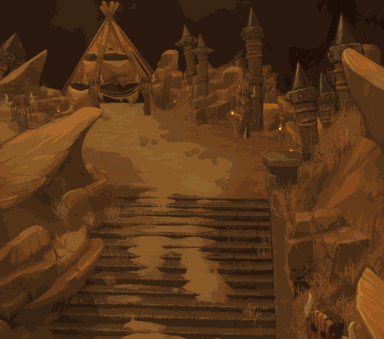

<!-- generated:start -->
<!-- generated-keys: title=0f8440 type=7a94db id=0ca927 sources=536ae8 name_key=9a5a32 kind=3e3f38 scene_type=77de68 max_users=ac3478 group=cb7a1d zones=48e5d9 segments=db31ca gates=442a94 connections=1f804d npcs=97d170 monsters=27d92e spawn_points=97d170 triggers=598977 dungeon=0ca927 -->
|  |  |
|---|---|
|  |  |
|  |  |
| **Field id** | `125` |
| **Kind** | dungeon (SceneList type 3; name *inferred*) |
| **Max users** | 5 (SceneList, column meaning *guessed*) |
| **Region group** | 37 (SceneList last column) |
| **Zones** | [[wiki/zones/141-field-dungeon-05-orc-lv-5-tow-canyon\|Field dungeon 05(orc) ((Lv 5) Tow Canyon)]] |
| **Terrain segments** | `ZP08_07` |
| **Dungeon** | [[wiki/dungeons/125-lv-5-tow-canyon\|dungeon page]] |
| **Name key** | `FieldName_125` |

### Gates and connections

`Teleport_List` rows of this field. A player sent to a gate id arrives at that gate's position (`server/travel.py`); the gate's own trigger is the portal object a little further out (*client*).

| gate | at (x, z) | leads to | arrives at gate | label |
|---|---|---|---|---|
| 1239 | 2096.91, 1994.54 | entrance / exit (leaving returns you to the field you came from) | 1239 | FieldName_125 |
| 1240 | 2120.48, 1841.94 | portal to gate 1241 in this field | 1241 | FiledPortal |
| 1241 | 2240.03, 1819.41 | portal to gate 1240 in this field | 1240 | FiledPortal |
| 1242 | 2202.76, 1903.27 | portal to gate 1243 in this field | 1243 | FiledPortal |
| 1243 | 2195.01, 1963.63 | portal to gate 1242 in this field | 1242 | FiledPortal |

### NPCs

None known yet.

### Monsters

| monster | unit | why it is listed |
|---|---|---|
| [[wiki/monsters/658-tow-warrior\|Tow Warrior]] | 658 | kill objective of quest [[wiki/quests/34-tow-canyon\|34]], [[wiki/quests/779-request-of-dispatch-knight\|779]], [[wiki/quests/1032-tow-canyon-hunting\|1032]] (kill group 10023, UnitDB i32@80); monster page (`spawns` / `spawn_fields`) |
| [[wiki/monsters/659-tow-sorcerer\|Tow Sorcerer]] | 659 | kill objective of quest [[wiki/quests/34-tow-canyon\|34]], [[wiki/quests/779-request-of-dispatch-knight\|779]], [[wiki/quests/1032-tow-canyon-hunting\|1032]] (kill group 10023, UnitDB i32@80); monster page (`spawns` / `spawn_fields`) |
| [[wiki/monsters/660-elite-tow-warrior\|Elite Tow Warrior]] | 660 | kill objective of quest [[wiki/quests/779-request-of-dispatch-knight\|779]], [[wiki/quests/1032-tow-canyon-hunting\|1032]] (kill group 10024, UnitDB i32@80); monster page (`spawns` / `spawn_fields`) |
| [[wiki/monsters/661-elite-tow-sorcerer\|Elite Tow Sorcerer]] | 661 | kill objective of quest [[wiki/quests/779-request-of-dispatch-knight\|779]], [[wiki/quests/1032-tow-canyon-hunting\|1032]] (kill group 10024, UnitDB i32@80); monster page (`spawns` / `spawn_fields`) |
| [[wiki/monsters/677-war-chief-garon\|War Chief Garon]] | 677 | kill objective of quest [[wiki/quests/758-group-border-area-hard-mode\|758]], [[wiki/quests/1034-tow-canyon-boss-hunting\|1034]] (kill group 10019, UnitDB i32@80); boss ([[gameplay/maps-and-dungeons#2. Border-area (normal/hard) dungeons\|Maps and dungeons]]); monster page (`spawns` / `spawn_fields`) |
| [[wiki/monsters/822-war-chief-garon\|War Chief Garon]] | 822 | boss ([[gameplay/maps-and-dungeons#2. Border-area (normal/hard) dungeons\|Maps and dungeons]]); monster page (`spawns` / `spawn_fields`) |
| [[wiki/monsters/1223-war-chief-garon\|War Chief Garon]] | 1223 | boss ([[gameplay/maps-and-dungeons#2. Border-area (normal/hard) dungeons\|Maps and dungeons]]); monster page (`spawns` / `spawn_fields`) |
| unit 10019 (not in UnitDB) | 10019 | hand-entered |
| unit 10023 (not in UnitDB) | 10023 | hand-entered |
| unit 10024 (not in UnitDB) | 10024 | hand-entered |

### Spawn points

Monster spawn positions are not in the client data (`map.jpk` has no spawn files; [[spec/monsters|Monsters]]). Add them to the monster's page (`spawns:` with `field`, `x`, `z`) or here as `spawn_points:` (`unit`, `x`, `z`, `count`, `radius`, `respawn_s`).

### Client-placed objects (`Trigger`)

Talk devices (shape 4) and gathering nodes (type 0, shape 5: the item is what gathering gives). The server can load these as they are; the video check in [[gameplay/video-dungeon-run|Nas Village dungeon run]] §5 matched them within 5 units.

| trigger | kind | name | gives | at (x, z) | type | model |
|---|---|---|---|---|---|---|
| [[wiki/nodes/12511-dispatch-knight\|12511]] | talk/device | Dispatch Knight |  | 2087.03, 1985.81 | 11 | 88 |
| [[wiki/nodes/12512-dispatch-knight\|12512]] | talk/device | Dispatch Knight |  | 2200.23, 1999.02 | 12 | 88 |
| [[wiki/nodes/12501-emerald\|12501]] | node | Emerald | [[wiki/items/806-emerald\|Emerald]] | 2100.76, 1973.46 | 0 | 1084 |
| [[wiki/nodes/12502-rosemary\|12502]] | node | Rosemary | [[wiki/items/822-rosemary\|Rosemary]] | 2140.16, 1971.2 | 0 | 3013 |
| [[wiki/nodes/12503-jasmine\|12503]] | node | Jasmine | [[wiki/items/824-jasmine\|Jasmine]] | 2106.52, 1893.65 | 0 | 3014 |
| [[wiki/nodes/12504-emerald\|12504]] | node | Emerald | [[wiki/items/806-emerald\|Emerald]] | 2100.9, 1870.66 | 0 | 1084 |
| [[wiki/nodes/12505-rosemary\|12505]] | node | Rosemary | [[wiki/items/822-rosemary\|Rosemary]] | 2222.81, 1839.37 | 0 | 3013 |
| [[wiki/nodes/12506-jasmine\|12506]] | node | Jasmine | [[wiki/items/824-jasmine\|Jasmine]] | 2255.4, 1836.04 | 0 | 3014 |
| [[wiki/nodes/12507-rosemary\|12507]] | node | Rosemary | [[wiki/items/822-rosemary\|Rosemary]] | 2230.56, 1894.53 | 0 | 3013 |
| [[wiki/nodes/12508-jasmine\|12508]] | node | Jasmine | [[wiki/items/824-jasmine\|Jasmine]] | 2196.1, 1894.84 | 0 | 3014 |
| [[wiki/nodes/12509-emerald\|12509]] | node | Emerald | [[wiki/items/806-emerald\|Emerald]] | 2221.17, 1956.71 | 0 | 1084 |
| [[wiki/nodes/12510-rosemary\|12510]] | node | Rosemary | [[wiki/items/822-rosemary\|Rosemary]] | 2241.96, 1971.52 | 0 | 3013 |
| [[wiki/nodes/12513-emerald\|12513]] | node | Emerald | [[wiki/items/806-emerald\|Emerald]] | 2218.56, 2007.44 | 0 | 1084 |
| [[wiki/nodes/12514-rosemary\|12514]] | node | Rosemary | [[wiki/items/822-rosemary\|Rosemary]] | 2193.03, 1986.26 | 0 | 3013 |

### Dungeon

Entry cost, rewards, boss and schedule: [[wiki/dungeons/125-lv-5-tow-canyon|(Lv 5) Tow Canyon]].

### Navmesh

Segments covered by this field's zones (256 × 256 units each). Check a point with `tools/navmesh.py check x z` ([[spec/navmesh|Navmesh]]).

| segment | navmesh (.nav) | terrain (.zp) |
|---|---|---|
| ZP08_07 | yes | yes |

### Mentioned in

- [[gameplay/crush-mechanics#9. Dungeons, bosses, farming|Crush Online mechanics from the forum § 9. Dungeons, bosses, farming]]
- [[gameplay/dungeon-drops|Dungeon drops (ores and herbs)]] (by name)
<!-- generated:end -->

## Notes

- Minimap layout (Tow Canyon): entry top-left, two columns of chambers, marker top-right; pink stars down the east side ([[gameplay/maps-and-dungeons|Maps and dungeons]] §2). Legend: framed box = entry portal, yellow four-arrow marker = probably the boss / exit, green leaves = herb nodes, blue diamonds = mineral nodes, pink stars = probably elite spawns. *image*
- Unlock level 24 (WM 0615, [[gameplay/patch-history|Patch history]]). *notes*
- Crush Online had Ghost Fortress at level 5 and Tow Canyon at level 6; the Warmonger client order (Tow 5, Ghost 6) is the one to use ([[gameplay/crush-mechanics|Crush mechanics]]; [[gameplay/server-rules|Server rules]]).

## Behaviour

- Solo, monsters do not respawn; with 2+ party members in hard mode they do. Reported respawn: first after 3-5 min then every minute (3 players), or starting at 9-10 min on the dungeon timer ([[gameplay/maps-and-dungeons|Maps and dungeons]] §2). WM 0404: with more than 2 users monsters respawn after 5 min; WM 0402 cut dungeon open time from 20 to 15 min ([[gameplay/patch-history|Patch history]]). *guides + notes*
- One portal is one instance with at most 5 players; the "Can not enter" option locks it ([[gameplay/maps-and-dungeons|Maps and dungeons]] §1). *guide*

## Sources

- [[gameplay/maps-and-dungeons|Maps and dungeons]], [[gameplay/patch-history|Patch history]].

## Open questions

<!-- hand-written: add what you know, with a source -->

<!-- credit:start -->
---
*Game content © GAMESinFLAMES / Joyimpact; reproduced for preservation and reference.*
<!-- credit:end -->
