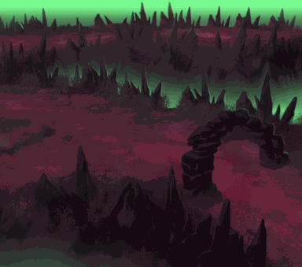

<!-- generated:start -->
<!-- generated-keys: title=0bf214 type=7a94db id=8b7471 sources=dc197a name_key=5cb35f kind=3e3f38 scene_type=77de68 max_users=ac3478 group=ca3512 zones=e96962 segments=7277be connections=97d170 npcs=97d170 monsters=417c4b spawn_points=97d170 triggers=daa166 dungeon=8b7471 -->
|  |  |
|---|---|
|  |  |
|  |  |
| **Field id** | `129` |
| **Kind** | dungeon (SceneList type 3; name *inferred*) |
| **Max users** | 5 (SceneList, column meaning *guessed*) |
| **Region group** | 39 (SceneList last column) |
| **Zones** | [[wiki/zones/134-field-dungeon-07-demon2-lv-8-thorn-s-hell\|Field dungeon 07(demon2) ((Lv 8) Thorn's Hell)]] |
| **Terrain segments** | `ZP03_07` |
| **Dungeon** | [[wiki/dungeons/129-lv-8-thorn-s-hell\|dungeon page]] |
| **Name key** | `FieldName_129` |

### Gates and connections

No `Teleport_List` row: the client places no gate here.

### NPCs

None known yet.

### Monsters

| monster | unit | why it is listed |
|---|---|---|
| [[wiki/monsters/679-demon-hunter\|Demon Hunter]] | 679 | kill objective of quest [[wiki/quests/36-thorn-s-hell\|36]], [[wiki/quests/746-devil-s-material\|746]], [[wiki/quests/1041-thorn-s-hell-hunting\|1041]] (kill group 10035, UnitDB i32@80); monster page (`spawns` / `spawn_fields`) |
| [[wiki/monsters/680-devil-miner\|Devil Miner]] | 680 | kill objective of quest [[wiki/quests/36-thorn-s-hell\|36]], [[wiki/quests/746-devil-s-material\|746]], [[wiki/quests/1041-thorn-s-hell-hunting\|1041]] (kill group 10035, UnitDB i32@80); monster page (`spawns` / `spawn_fields`) |
| [[wiki/monsters/681-elite-demon-hunter\|Elite Demon Hunter]] | 681 | kill objective of quest [[wiki/quests/746-devil-s-material\|746]], [[wiki/quests/1041-thorn-s-hell-hunting\|1041]] (kill group 10036, UnitDB i32@80); monster page (`spawns` / `spawn_fields`) |
| [[wiki/monsters/682-elite-devil-miner\|Elite Devil Miner]] | 682 | kill objective of quest [[wiki/quests/746-devil-s-material\|746]], [[wiki/quests/1041-thorn-s-hell-hunting\|1041]] (kill group 10036, UnitDB i32@80); monster page (`spawns` / `spawn_fields`) |
| [[wiki/monsters/849-akasha\|Akasha]] | 849 | boss ([[gameplay/maps-and-dungeons#2. Border-area (normal/hard) dungeons\|Maps and dungeons]]); monster page (`spawns` / `spawn_fields`) |
| unit 9999 (not in UnitDB) | 9999 | hand-entered |
| unit 10035 (not in UnitDB) | 10035 | hand-entered |
| unit 10036 (not in UnitDB) | 10036 | hand-entered |

### Spawn points

Monster spawn positions are not in the client data (`map.jpk` has no spawn files; [[spec/monsters|Monsters]]). Add them to the monster's page (`spawns:` with `field`, `x`, `z`) or here as `spawn_points:` (`unit`, `x`, `z`, `count`, `radius`, `respawn_s`).

### Client-placed objects (`Trigger`)

Talk devices (shape 4) and gathering nodes (type 0, shape 5: the item is what gathering gives). The server can load these as they are; the video check in [[gameplay/video-dungeon-run|Nas Village dungeon run]] §5 matched them within 5 units.

| trigger | kind | name | gives | at (x, z) | type | model |
|---|---|---|---|---|---|---|
| [[wiki/nodes/12901-emerald\|12901]] | node | Emerald | [[wiki/items/806-emerald\|Emerald]] | 889.72, 1809.42 | 0 | 1084 |
| [[wiki/nodes/12902-rosemary\|12902]] | node | Rosemary | [[wiki/items/822-rosemary\|Rosemary]] | 925.21, 1826.45 | 0 | 3013 |
| [[wiki/nodes/12903-jasmine\|12903]] | node | Jasmine | [[wiki/items/824-jasmine\|Jasmine]] | 920.43, 1847.58 | 0 | 3014 |
| [[wiki/nodes/12904-emerald\|12904]] | node | Emerald | [[wiki/items/806-emerald\|Emerald]] | 910.75, 1873.57 | 0 | 1084 |
| [[wiki/nodes/12905-rosemary\|12905]] | node | Rosemary | [[wiki/items/822-rosemary\|Rosemary]] | 846.5, 1896.18 | 0 | 3013 |
| [[wiki/nodes/12906-jasmine\|12906]] | node | Jasmine | [[wiki/items/824-jasmine\|Jasmine]] | 834.49, 1923.07 | 0 | 3014 |
| [[wiki/nodes/12907-rosemary\|12907]] | node | Rosemary | [[wiki/items/822-rosemary\|Rosemary]] | 855.82, 1977.31 | 0 | 3013 |
| [[wiki/nodes/12908-jasmine\|12908]] | node | Jasmine | [[wiki/items/824-jasmine\|Jasmine]] | 845.3, 2019.92 | 0 | 3014 |
| [[wiki/nodes/12909-emerald\|12909]] | node | Emerald | [[wiki/items/806-emerald\|Emerald]] | 921.11, 2020.93 | 0 | 1084 |
| [[wiki/nodes/12910-rosemary\|12910]] | node | Rosemary | [[wiki/items/822-rosemary\|Rosemary]] | 947.15, 2015.94 | 0 | 3013 |
| [[wiki/nodes/12911-emerald\|12911]] | node | Emerald | [[wiki/items/806-emerald\|Emerald]] | 935.45, 1975.11 | 0 | 1084 |
| [[wiki/nodes/12912-rosemary\|12912]] | node | Rosemary | [[wiki/items/822-rosemary\|Rosemary]] | 905.14, 1980.47 | 0 | 3013 |

### Dungeon

Entry cost, rewards, boss and schedule: [[wiki/dungeons/129-lv-8-thorn-s-hell|(Lv 8) Thorn's Hell]].

### Navmesh

Segments covered by this field's zones (256 × 256 units each). Check a point with `tools/navmesh.py check x z` ([[spec/navmesh|Navmesh]]).

| segment | navmesh (.nav) | terrain (.zp) |
|---|---|---|
| ZP03_07 | yes | yes |

### Mentioned in

- [[gameplay/dungeon-drops|Dungeon drops (ores and herbs)]] (by name)
<!-- generated:end -->

## Notes

<!-- hand-written: add what you know, with a source -->

## Behaviour

<!-- hand-written: add what you know, with a source -->

## Sources

<!-- hand-written: add what you know, with a source -->

## Open questions

<!-- hand-written: add what you know, with a source -->

<!-- credit:start -->
---
*Game content © GAMESinFLAMES / Joyimpact; reproduced for preservation and reference.*
<!-- credit:end -->
