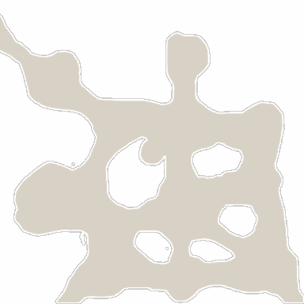

<!-- generated:start -->
<!-- generated-keys: title=53cfef type=7a94db id=12c6fc sources=f65ce3 name_key=6a910b kind=8e3535 scene_type=da4b92 max_users=22d200 group=ac3478 scene_c4=da4b92 neighbours=23f206 zones=80af3c segments=b93c6c worldmap_rect=8fbea6 gates=8a59e7 connections=88b48b npcs=97d170 monsters=97d170 spawn_points=97d170 -->
|  |  |
|---|---|
|  |  |
| **Field id** | `22` |
| **Kind** | land (SceneList type 2; name *inferred*) |
| **Max users** | 30 (SceneList, column meaning *guessed*) |
| **Region group** | 5 (SceneList last column) |
| **Zones** | [[wiki/zones/47-field-22-afterlife-hill\|Field 22 (Afterlife Hill)]] |
| **Terrain segments** | `ZP02_03` |
| **World-map rectangle** | `[1040, 312, 1116, 402]` (WorldmapData, panel pixels) |
| **Name key** | `FieldName_22` |

A land of Gaia. Who owns it (Arslan, Erion, Armia or monsters) changes in play and is server state; see [[gameplay/maps-and-dungeons|Maps and dungeons]] §1 and §4.

### Gates and connections

`Teleport_List` rows of this field. A player sent to a gate id arrives at that gate's position (`server/travel.py`); the gate's own trigger is the portal object a little further out (*client*).

| gate | at (x, z) | leads to | arrives at gate | label |
|---|---|---|---|---|
| 261 | 578.96, 956.52 | [[wiki/fields/16-refuge-of-old-dragon\|Refuge of old dragon]] | 320 | FieldName_22 |
| 361 | 598.66, 839.69 | [[wiki/fields/26-echo-of-earth\|Echo of Earth]] | 321 | FieldName_22 |
| 570 | 693.85, 851.96 | [[wiki/fields/47-burning-earth\|Burning Earth]] | 322 | FieldName_22 |

Entered from: [[wiki/fields/16-refuge-of-old-dragon|Refuge of old dragon]] (gate 320 → 261), [[wiki/fields/26-echo-of-earth|Echo of Earth]] (gate 321 → 361), [[wiki/fields/47-burning-earth|Burning Earth]] (gate 322 → 570)

Neighbouring lands (`SceneList` link columns): [[wiki/fields/16-refuge-of-old-dragon|Refuge of old dragon]], [[wiki/fields/26-echo-of-earth|Echo of Earth]], [[wiki/fields/47-burning-earth|Burning Earth]]

### NPCs

None known yet.

### Monsters

None known yet.

### Spawn points

Monster spawn positions are not in the client data (`map.jpk` has no spawn files; [[spec/monsters|Monsters]]). Add them to the monster's page (`spawns:` with `field`, `x`, `z`) or here as `spawn_points:` (`unit`, `x`, `z`, `count`, `radius`, `respawn_s`).

### Navmesh

Segments covered by this field's zones (256 × 256 units each). Check a point with `tools/navmesh.py check x z` ([[spec/navmesh|Navmesh]]).

| segment | navmesh (.nav) | terrain (.zp) |
|---|---|---|
| ZP02_03 | yes | yes |
<!-- generated:end -->

## Notes

<!-- hand-written: add what you know, with a source -->

## Behaviour

<!-- hand-written: add what you know, with a source -->

## Sources

<!-- hand-written: add what you know, with a source -->

## Open questions

<!-- hand-written: add what you know, with a source -->

<!-- credit:start -->
---
*Game content © GAMESinFLAMES / Joyimpact; reproduced for preservation and reference.*
<!-- credit:end -->
