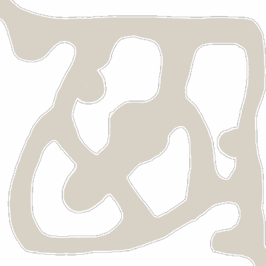

<!-- generated:start -->
<!-- generated-keys: title=55e51e type=7a94db id=d435a6 sources=0a16a3 name_key=61c388 kind=8e3535 scene_type=da4b92 max_users=22d200 group=0ade7c scene_c4=356a19 neighbours=db7db0 zones=b8da6a segments=720ba9 worldmap_rect=ebc269 gates=59b8b1 connections=326096 npcs=97d170 monsters=97d170 spawn_points=97d170 -->
|  |  |
|---|---|
|  |  |
| **Field id** | `23` |
| **Kind** | land (SceneList type 2; name *inferred*) |
| **Max users** | 30 (SceneList, column meaning *guessed*) |
| **Region group** | 9 (SceneList last column) |
| **Zones** | [[wiki/zones/48-field-23-fairy-s-wood\|Field 23 (Fairy's Wood)]] |
| **Terrain segments** | `ZP03_03` |
| **World-map rectangle** | `[667, 538, 760, 589]` (WorldmapData, panel pixels) |
| **Name key** | `FieldName_23` |

A land of Gaia. Who owns it (Arslan, Erion, Armia or monsters) changes in play and is server state; see [[gameplay/maps-and-dungeons|Maps and dungeons]] §1 and §4.

### Gates and connections

`Teleport_List` rows of this field. A player sent to a gate id arrives at that gate's position (`server/travel.py`); the gate's own trigger is the portal object a little further out (*client*).

| gate | at (x, z) | leads to | arrives at gate | label |
|---|---|---|---|---|
| 272 | 816.49, 933.25 | [[wiki/fields/17-eternal-river-middle-region\|Eternal River - Middle Region]] | 330 | FieldName_23 |
| 370 | 933.61, 813.83 | [[wiki/fields/27-spirit-s-hill\|Spirit's Hill]] | 331 | FieldName_23 |

Entered from: [[wiki/fields/17-eternal-river-middle-region|Eternal River - Middle Region]] (gate 330 → 272), [[wiki/fields/27-spirit-s-hill|Spirit's Hill]] (gate 331 → 370)

Neighbouring lands (`SceneList` link columns): [[wiki/fields/17-eternal-river-middle-region|Eternal River - Middle Region]], [[wiki/fields/27-spirit-s-hill|Spirit's Hill]]

### NPCs

None known yet.

### Monsters

None known yet.

### Spawn points

Monster spawn positions are not in the client data (`map.jpk` has no spawn files; [[spec/monsters|Monsters]]). Add them to the monster's page (`spawns:` with `field`, `x`, `z`) or here as `spawn_points:` (`unit`, `x`, `z`, `count`, `radius`, `respawn_s`).

### Navmesh

Segments covered by this field's zones (256 × 256 units each). Check a point with `tools/navmesh.py check x z` ([[spec/navmesh|Navmesh]]).

| segment | navmesh (.nav) | terrain (.zp) |
|---|---|---|
| ZP03_03 | yes | yes |

### Mentioned in

- [[gameplay/lords-of-the-land|Lords of the Land buff and quest]] (by name)
<!-- generated:end -->

## Notes

- On the October 2016 Crush world map (Erion's view) this land was in the brown NPC-held block on the west ([[gameplay/lords-of-the-land|Lords of the Land]] §6). *image*

## Behaviour

<!-- hand-written: add what you know, with a source -->

## Sources

<!-- hand-written: add what you know, with a source -->

## Open questions

<!-- hand-written: add what you know, with a source -->

<!-- credit:start -->
---
*Game content © GAMESinFLAMES / Joyimpact; reproduced for preservation and reference.*
<!-- credit:end -->
