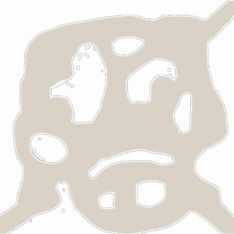

<!-- generated:start -->
<!-- generated-keys: title=e8a168 type=7a94db id=b6692e sources=250322 name_key=5b888d kind=8e3535 scene_type=da4b92 max_users=22d200 group=77de68 scene_c4=da4b92 neighbours=af3964 zones=acdb59 segments=05c4c5 worldmap_rect=f990af gates=8e19bb connections=52d43a npcs=97d170 monsters=97d170 spawn_points=97d170 -->
|  |  |
|---|---|
|  |  |
| **Field id** | `33` |
| **Kind** | land (SceneList type 2; name *inferred*) |
| **Max users** | 30 (SceneList, column meaning *guessed*) |
| **Region group** | 3 (SceneList last column) |
| **Zones** | [[wiki/zones/55-field-33-dreamer-s-refuge\|Field 33 (Dreamer's Refuge)]] |
| **Terrain segments** | `ZP13_03` |
| **World-map rectangle** | `[639, 734, 737, 786]` (WorldmapData, panel pixels) |
| **Name key** | `FieldName_33` |

A land of Gaia. Who owns it (Arslan, Erion, Armia or monsters) changes in play and is server state; see [[gameplay/maps-and-dungeons|Maps and dungeons]] §1 and §4.

### Gates and connections

`Teleport_List` rows of this field. A player sent to a gate id arrives at that gate's position (`server/travel.py`); the gate's own trigger is the portal object a little further out (*client*).

| gate | at (x, z) | leads to | arrives at gate | label |
|---|---|---|---|---|
| 382 | 3390.77, 823.05 | [[wiki/fields/28-spirit-s-refuge\|Spirit's Refuge]] | 430 | FieldName_33 |
| 441 | 3480.35, 938.3 | [[wiki/fields/34-skymist-lake\|Skymist Lake]] | 431 | FieldName_33 |
| 450 | 3499.65, 825.61 | [[wiki/fields/35-skymist-temple\|Skymist Temple]] | 432 | FieldName_33 |

Entered from: [[wiki/fields/28-spirit-s-refuge|Spirit's Refuge]] (gate 430 → 382), [[wiki/fields/34-skymist-lake|Skymist Lake]] (gate 431 → 441), [[wiki/fields/35-skymist-temple|Skymist Temple]] (gate 432 → 450)

Neighbouring lands (`SceneList` link columns): [[wiki/fields/28-spirit-s-refuge|Spirit's Refuge]], [[wiki/fields/35-skymist-temple|Skymist Temple]], [[wiki/fields/34-skymist-lake|Skymist Lake]]

### NPCs

None known yet.

### Monsters

None known yet.

### Spawn points

Monster spawn positions are not in the client data (`map.jpk` has no spawn files; [[spec/monsters|Monsters]]). Add them to the monster's page (`spawns:` with `field`, `x`, `z`) or here as `spawn_points:` (`unit`, `x`, `z`, `count`, `radius`, `respawn_s`).

### Navmesh

Segments covered by this field's zones (256 × 256 units each). Check a point with `tools/navmesh.py check x z` ([[spec/navmesh|Navmesh]]).

| segment | navmesh (.nav) | terrain (.zp) |
|---|---|---|
| ZP13_03 | yes | yes |
<!-- generated:end -->

## Notes

<!-- hand-written: add what you know, with a source -->

## Behaviour

<!-- hand-written: add what you know, with a source -->

## Sources

<!-- hand-written: add what you know, with a source -->

## Open questions

<!-- hand-written: add what you know, with a source -->

<!-- credit:start -->
---
*Game content © GAMESinFLAMES / Joyimpact; reproduced for preservation and reference.*
<!-- credit:end -->
