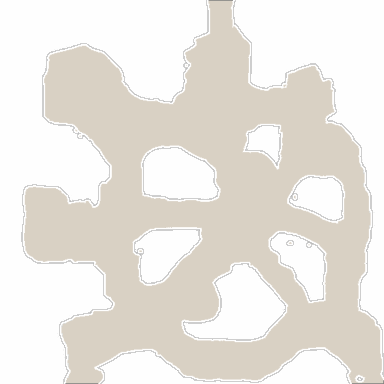

<!-- generated:start -->
<!-- generated-keys: title=324652 type=7a94db id=fe2ef4 sources=1ad52f name_key=51274d kind=8e3535 scene_type=da4b92 max_users=22d200 group=fe5dbb scene_c4=da4b92 neighbours=80cf3e zones=4ebe06 segments=027045 worldmap_rect=97cb1c gates=2a70c2 connections=815e60 npcs=97d170 monsters=97d170 spawn_points=97d170 -->
|  |  |
|---|---|
|  |  |
| **Field id** | `46` |
| **Kind** | land (SceneList type 2; name *inferred*) |
| **Max users** | 30 (SceneList, column meaning *guessed*) |
| **Region group** | 8 (SceneList last column) |
| **Zones** | [[wiki/zones/25-field-46-spider-nest\|Field 46 (Spider Nest)]] |
| **Terrain segments** | `ZP06_04` |
| **World-map rectangle** | `[1092, 530, 1154, 602]` (WorldmapData, panel pixels) |
| **Name key** | `FieldName_46` |

A land of Gaia. Who owns it (Arslan, Erion, Armia or monsters) changes in play and is server state; see [[gameplay/maps-and-dungeons|Maps and dungeons]] §1 and §4.

### Gates and connections

`Teleport_List` rows of this field. A player sent to a gate id arrives at that gate's position (`server/travel.py`); the gate's own trigger is the portal object a little further out (*client*).

| gate | at (x, z) | leads to | arrives at gate | label |
|---|---|---|---|---|
| 362 | 1653.84, 1221.72 | [[wiki/fields/26-echo-of-earth\|Echo of Earth]] | 560 | FieldName_46 |
| 422 | 1602.38, 1109.77 | [[wiki/fields/32-long-road\|Long Road]] | 561 | FieldName_46 |
| 580 | 1717.25, 1108.5 | [[wiki/fields/48-ashes-ruin\|Ashes Ruin]] | 562 | FieldName_46 |

Entered from: [[wiki/fields/26-echo-of-earth|Echo of Earth]] (gate 560 → 362), [[wiki/fields/32-long-road|Long Road]] (gate 561 → 422), [[wiki/fields/48-ashes-ruin|Ashes Ruin]] (gate 562 → 580)

Neighbouring lands (`SceneList` link columns): [[wiki/fields/32-long-road|Long Road]], [[wiki/fields/26-echo-of-earth|Echo of Earth]], [[wiki/fields/48-ashes-ruin|Ashes Ruin]]

### NPCs

None known yet.

### Monsters

None known yet.

### Spawn points

Monster spawn positions are not in the client data (`map.jpk` has no spawn files; [[spec/monsters|Monsters]]). Add them to the monster's page (`spawns:` with `field`, `x`, `z`) or here as `spawn_points:` (`unit`, `x`, `z`, `count`, `radius`, `respawn_s`).

### Navmesh

Segments covered by this field's zones (256 × 256 units each). Check a point with `tools/navmesh.py check x z` ([[spec/navmesh|Navmesh]]).

| segment | navmesh (.nav) | terrain (.zp) |
|---|---|---|
| ZP06_04 | yes | yes |

### Mentioned in

- [[gameplay/maps-and-dungeons|Maps and dungeons]] (by name)
<!-- generated:end -->

## Notes

<!-- hand-written: add what you know, with a source -->

## Behaviour

<!-- hand-written: add what you know, with a source -->

## Sources

<!-- hand-written: add what you know, with a source -->

## Open questions

<!-- hand-written: add what you know, with a source -->

<!-- credit:start -->
---
*Game content © GAMESinFLAMES / Joyimpact; reproduced for preservation and reference.*
<!-- credit:end -->
