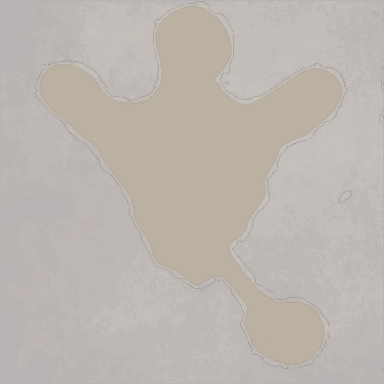

<!-- generated:start -->
<!-- generated-keys: title=93abca type=7a94db id=e62d7f sources=9a0e58 name_key=230a99 kind=da9544 scene_type=356a19 max_users=310b86 group=bd307a nation=a20b0f nation_copies=b9e49f zones=187cfc segments=030709 gates=ee4d64 connections=97d170 npcs=97d170 monsters=97d170 spawn_points=97d170 -->
|  |  |
|---|---|
|  |  |
| **Field id** | `87` |
| **Kind** | town (SceneList type 1; name *inferred*) |
| **Max users** | 100 (SceneList, column meaning *guessed*) |
| **Region group** | 13 (SceneList last column) |
| **Nation** | Arslan |
| **Nation copies** | Arslan **87**, Erion [[wiki/fields/91-village\|Erion (91)]], Armia [[wiki/fields/95-village\|Armia (95)]] |
| **Zones** | [[wiki/zones/102-town-a-village\|Town A (Village)]] |
| **Terrain segments** | `ZP10_01` |
| **Name key** | `FieldName_87` |

### Gates and connections

`Teleport_List` rows of this field. A player sent to a gate id arrives at that gate's position (`server/travel.py`); the gate's own trigger is the portal object a little further out (*client*).

| gate | at (x, z) | leads to | arrives at gate | label |
|---|---|---|---|---|
| 0 | 2688.83, 382.86 | arrival / spawn point only | — | FieldName_87 |

Entered from: [[wiki/fields/88-training-camp|Training Camp]] (gate 1201 → ?), [[wiki/fields/92-training-camp|Training Camp]] (gate 1204 → ?), [[wiki/fields/96-training-camp|Training Camp]] (gate 1207 → ?)

### NPCs

None known yet.

### Monsters

None known yet.

### Spawn points

Monster spawn positions are not in the client data (`map.jpk` has no spawn files; [[spec/monsters|Monsters]]). Add them to the monster's page (`spawns:` with `field`, `x`, `z`) or here as `spawn_points:` (`unit`, `x`, `z`, `count`, `radius`, `respawn_s`).

### Navmesh

Segments covered by this field's zones (256 × 256 units each). Check a point with `tools/navmesh.py check x z` ([[spec/navmesh|Navmesh]]).

| segment | navmesh (.nav) | terrain (.zp) |
|---|---|---|
| ZP10_01 | yes | yes |

### Mentioned in

- [[gameplay/npc-locations#1. What the client data contains (and what it does not)|NPC and point-of-interest locations § 1. What the client data contains (and what it does not)]]
<!-- generated:end -->

## Notes

- The Village is the old copy of the town map: its segments use the same navmesh as the Fortress. Segment origin of this copy: (2560, 256) ([[gameplay/npc-locations|NPC locations]] §2). *client*
- Its only `Teleport_List` row is gate 0 at (2688.83, 382.86), which links to itself, so it is a spawn point, not a way out. The Arslan start point (2688.83, 382.86) is local (128.8, 126.9), the centre of the Fortress plaza ([[gameplay/npc-locations|NPC locations]] §2, §6). *client*
- In 2018 players went Training Camp → Castle → Fortress; the camp's Village gate had no portal icon ([video](https://www.youtube.com/watch?v=E-87WgbO_vo&t=845s), [[gameplay/npc-locations|NPC locations]] §2). No video shows NPCs here ([[gameplay/npc-locations|NPC locations]] §6). *video*

## Behaviour

<!-- hand-written: add what you know, with a source -->

## Sources

<!-- hand-written: add what you know, with a source -->

## Open questions

- Whether players could reach the Village at all in the 2018 game, and which NPCs (if any) stood here, is unknown; `npcs` and `connections` stay empty until a source turns up.

<!-- credit:start -->
---
*Game content © GAMESinFLAMES / Joyimpact; reproduced for preservation and reference.*
<!-- credit:end -->
