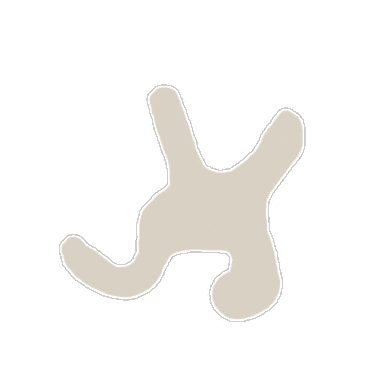

<!-- generated:start -->
<!-- generated-keys: title=908c23 type=7a94db id=6fb84a sources=0e42e8 name_key=4b4de5 kind=da9544 scene_type=356a19 max_users=310b86 group=bd307a nation=b0e09b nation_copies=908462 zones=e6de85 segments=47124c gates=35eb76 connections=d4fb1f npcs=724d9d monsters=97d170 spawn_points=97d170 -->
|  |  |
|---|---|
|  |  |
| **Field id** | `96` |
| **Kind** | town (SceneList type 1; name *inferred*) |
| **Max users** | 100 (SceneList, column meaning *guessed*) |
| **Region group** | 13 (SceneList last column) |
| **Nation** | Armia |
| **Nation copies** | Arslan [[wiki/fields/88-training-camp\|Arslan (88)]], Erion [[wiki/fields/92-training-camp\|Erion (92)]], Armia **96** |
| **Zones** | [[wiki/zones/130-training-camp-c\|Training Camp C]] |
| **Terrain segments** | `ZP03_13` |
| **Name key** | `FieldName_96` |

### Gates and connections

`Teleport_List` rows of this field. A player sent to a gate id arrives at that gate's position (`server/travel.py`); the gate's own trigger is the portal object a little further out (*client*).

| gate | at (x, z) | leads to | arrives at gate | label |
|---|---|---|---|---|
| 1194 | 915.98, 3492.03 | [[wiki/fields/98-castle\|Castle]] | 1195 (paired, *inferred*) | FieldName_96 |
| 1207 | 868.37, 3501.95 | [[wiki/fields/87-village\|Village]] | — | FieldName_96 |
| 1208 | 839.36, 3437.42 | [[wiki/fields/97-training-ground\|Training Ground]] | 1209 (paired, *inferred*) | FieldName_96 |
| 1505 | 903.36, 3436.17 | [[wiki/fields/101-corpse-incineration\|Corpse incineration]] | 1505 | FieldName_96 |

Entered from: [[wiki/fields/97-training-ground|Training Ground]] (gate 1209 → 1208), [[wiki/fields/98-castle|Castle]] (gate 1195 → 1194), [[wiki/fields/101-corpse-incineration|Corpse incineration]] (gate 1502 → 1502)

### NPCs

Positions come from the NPC's own page (`x`, `z`). The client does not place town NPCs; the server spawns them ([[gameplay/npc-locations|NPC locations]] §1).

| NPC | unit | position | why it is listed |
|---|---|---|---|
| [[wiki/npcs/198-frei\|Frei]] | 198 | 870.8, 3469.1 | quests [[wiki/quests/9-find-the-missing-scout\|9]], [[wiki/quests/11-an-urgent-message\|11]], [[wiki/quests/45-the-1st-challenge-chepas-ahead\|45]]; [[gameplay/npc-locations#4. Training Camp (fields 88 / 92 / 96)\|NPC locations § 4. Training Camp (fields 88 / 92 / 96)]]; NPC page (`map` / `positions`) |
| [[wiki/npcs/215-guard\|Guard]] | 215 | 897, 3436.4 | quests [[wiki/quests/9-find-the-missing-scout\|9]]; [[gameplay/npc-locations#4. Training Camp (fields 88 / 92 / 96)\|NPC locations § 4. Training Camp (fields 88 / 92 / 96)]]; NPC page (`map` / `positions`) |
| [[wiki/npcs/238-wren\|Wren]] | 238 | 885.8, 3479.5 | quests [[wiki/quests/28-what-does-wren-do\|28]], [[wiki/quests/102-wren-s-sister-wren\|102]]; [[gameplay/npc-locations#4. Training Camp (fields 88 / 92 / 96)\|NPC locations § 4. Training Camp (fields 88 / 92 / 96)]]; NPC page (`map` / `positions`) |
| [[wiki/npcs/315-lewellyn\|Lewellyn]] | 315 | 890.9, 3478.9 | quests [[wiki/quests/100-hunting-for-furs\|100]]; [[gameplay/npc-locations#4. Training Camp (fields 88 / 92 / 96)\|NPC locations § 4. Training Camp (fields 88 / 92 / 96)]]; NPC page (`map` / `positions`) |
| [[wiki/npcs/335-odin\|Odin]] | 335 | 899.1, 3478.9 | quests [[wiki/quests/101-all-sorts-of-fragile-bones\|101]]; [[gameplay/npc-locations#4. Training Camp (fields 88 / 92 / 96)\|NPC locations § 4. Training Camp (fields 88 / 92 / 96)]]; NPC page (`map` / `positions`) |
| [[wiki/npcs/218-mail-box\|Mail box]] | 218 |  | [[gameplay/npc-locations#4. Training Camp (fields 88 / 92 / 96)\|NPC locations § 4. Training Camp (fields 88 / 92 / 96)]] |
| [[wiki/npcs/337-owen\|Owen]] | 337 | 905.7, 3470.4 | [[gameplay/npc-locations#4. Training Camp (fields 88 / 92 / 96)\|NPC locations § 4. Training Camp (fields 88 / 92 / 96)]]; NPC page (`map` / `positions`) |

### Monsters

None known yet.

### Spawn points

Monster spawn positions are not in the client data (`map.jpk` has no spawn files; [[spec/monsters|Monsters]]). Add them to the monster's page (`spawns:` with `field`, `x`, `z`) or here as `spawn_points:` (`unit`, `x`, `z`, `count`, `radius`, `respawn_s`).

### Quests in this field

[[wiki/quests/9-find-the-missing-scout|Find the missing Scout]], [[wiki/quests/11-an-urgent-message|An urgent message]], [[wiki/quests/45-the-1st-challenge-chepas-ahead|The 1st Challenge: Chepas ahead]], [[wiki/quests/100-hunting-for-furs|Hunting for Furs]], [[wiki/quests/101-all-sorts-of-fragile-bones|All sorts of Fragile bones]], [[wiki/quests/102-wren-s-sister-wren|Wren's sister Wren?]]

### Navmesh

Segments covered by this field's zones (256 × 256 units each). Check a point with `tools/navmesh.py check x z` ([[spec/navmesh|Navmesh]]).

| segment | navmesh (.nav) | terrain (.zp) |
|---|---|---|
| ZP03_13 | yes | yes |

### Mentioned in

- [[gameplay/abyss-map#Ways in and out|Abyss map and portal graph § Ways in and out]]
- [[gameplay/maps-and-dungeons#1. The world (Gaia)|Maps and dungeons § 1. The world (Gaia)]]
- [[gameplay/npc-locations#4. Training Camp (fields 88 / 92 / 96)|NPC and point-of-interest locations § 4. Training Camp (fields 88 / 92 / 96)]]
- [[gameplay/consumables|Consumables and clickables]] (by name)
- [[gameplay/crush-patch-notes|Crush Online patch notes 2016–17]] (by name)
- [[gameplay/events-and-schedules|Events, schedules and PvP rewards]] (by name)
- [[gameplay/server-rules|Server rules checklist]] (by name)
- [[gameplay/sources|Sources and gaps]] (by name)
- [[gameplay/video-character-creation-and-tutorial|Video notes: character creation and tutorial (ZonderCoRe, June 2018)]] (by name)
- [[gameplay/video-early-quests|Video notes: first session, levels 1+ (charmanmugen)]] (by name)
- [[gameplay/video-tutorial-walkthrough|Video notes: tutorial walkthrough (Bravely Forward 2)]] (by name)
<!-- generated:end -->

## Notes

<!-- hand-written: add what you know, with a source -->

## Behaviour

<!-- hand-written: add what you know, with a source -->

## Sources

<!-- hand-written: add what you know, with a source -->

## Open questions

<!-- hand-written: add what you know, with a source -->

<!-- credit:start -->
---
*Game content © GAMESinFLAMES / Joyimpact; reproduced for preservation and reference.*
<!-- credit:end -->
