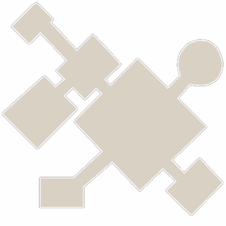

<!-- generated:start -->
<!-- generated-keys: title=b1fd66 type=7a94db id=31bd9b sources=204a72 name_key=26f763 kind=da9544 scene_type=356a19 max_users=310b86 group=bd307a nation=b0e09b nation_copies=95169d zones=1378c7 segments=237e6c gates=8e0f9a connections=b021dd npcs=388bbc monsters=97d170 spawn_points=97d170 -->
|  |  |
|---|---|
|  |  |
| **Field id** | `98` |
| **Kind** | town (SceneList type 1; name *inferred*) |
| **Max users** | 100 (SceneList, column meaning *guessed*) |
| **Region group** | 13 (SceneList last column) |
| **Nation** | Armia |
| **Nation copies** | Arslan [[wiki/fields/90-castle\|Arslan (90)]], Erion [[wiki/fields/94-castle\|Erion (94)]], Armia **98** |
| **Zones** | [[wiki/zones/146-c-castle-big-city\|C Castle (big city)]] |
| **Terrain segments** | `ZP03_16` |
| **Name key** | `FieldName_98` |

### Gates and connections

`Teleport_List` rows of this field. A player sent to a gate id arrives at that gate's position (`server/travel.py`); the gate's own trigger is the portal object a little further out (*client*).

| gate | at (x, z) | leads to | arrives at gate | label |
|---|---|---|---|---|
| 1195 | 829.42, 4135.5 | [[wiki/fields/96-training-camp\|Training Camp]] | 1194 (paired, *inferred*) | FieldName_98 |
| 1430 | 843.57, 4133.81 | arrival / spawn point only | 1430 | FieldName_98 |

Entered from: [[wiki/fields/96-training-camp|Training Camp]] (gate 1194 → 1195)

### NPCs

Positions come from the NPC's own page (`x`, `z`). The client does not place town NPCs; the server spawns them ([[gameplay/npc-locations|NPC locations]] §1).

| NPC | unit | position | why it is listed |
|---|---|---|---|
| [[wiki/npcs/219-krister\|Krister]] | 219 | 1001.7, 4139.6 | quests [[wiki/quests/106-talk-to-krister\|106]]; NPC page (`map` / `positions`) |
| [[wiki/npcs/327-aenes\|Aenes]] | 327 |  | quests [[wiki/quests/38-innocence-s-recovery-operation\|38]], [[wiki/quests/44-innocence-report\|44]] |
| [[wiki/npcs/2001-corpse-bride\|Corpse Bride]] | 2001 |  | quests [[wiki/quests/903-trick-or-treat\|903]] |
| [[wiki/npcs/199-patrick\|Patrick]] | 199 | 998.1, 4292.5 | NPC page (`map` / `positions`) |
| [[wiki/npcs/224-bernice\|Bernice]] | 224 | 1005.8, 4285.8 | NPC page (`map` / `positions`) |

### Monsters

None known yet.

### Spawn points

Monster spawn positions are not in the client data (`map.jpk` has no spawn files; [[spec/monsters|Monsters]]). Add them to the monster's page (`spawns:` with `field`, `x`, `z`) or here as `spawn_points:` (`unit`, `x`, `z`, `count`, `radius`, `respawn_s`).

### Quests in this field

[[wiki/quests/38-innocence-s-recovery-operation|Innocence's recovery operation]], [[wiki/quests/106-talk-to-krister|Talk to Krister]], [[wiki/quests/903-trick-or-treat|Trick or Treat!!]]

### Navmesh

Segments covered by this field's zones (256 × 256 units each). Check a point with `tools/navmesh.py check x z` ([[spec/navmesh|Navmesh]]).

| segment | navmesh (.nav) | terrain (.zp) |
|---|---|---|
| ZP03_16 | yes | yes |

### Mentioned in

- [[gameplay/maps-and-dungeons#1. The world (Gaia)|Maps and dungeons § 1. The world (Gaia)]]
<!-- generated:end -->

## Notes

<!-- hand-written: add what you know, with a source -->

## Behaviour

<!-- hand-written: add what you know, with a source -->

## Sources

<!-- hand-written: add what you know, with a source -->

## Open questions

<!-- hand-written: add what you know, with a source -->

<!-- credit:start -->
---
*Game content © GAMESinFLAMES / Joyimpact; reproduced for preservation and reference.*
<!-- credit:end -->
