<!-- generated:start -->
<!-- generated-keys: title=f796d2 type=0814f8 id=ac3478 sources=71bfff pool=ac3478 contents=a2924c price=3ee17d bag_slots_needed=b1d578 kind=a22c27 -->
|  |  |
|---|---|
| **Pool** | `5` (`Gacha_05.cdb`, 0x4aa gacha_type 5) |
| **Price** | 5,000 Jewels (yellow + purple) |
| **Bag slots needed** | 10 |
| **Odds** | unknown (server side, never published) |
| **Entries** | 91 (57 distinct items) |

### Card text

> You can earn items between 2 and 3 tiers (Normal, Superior)

### What the 2018 card listed

[[gameplay/events-and-schedules|Events and schedules]] §10 (WM 1018 image): Normal / Superior Weapon (2–3), Rare Weapon (1–2), Normal / Superior / Rare Rainbow stone. The match of this client pool to that card is *inferred* from the tiers and contents.

### Contents

`grade` and `c3` are the table's own columns. In the paid pools grade 3 rows have `c3` 0, grade 2 rows `c3` 1 and grade 1 rows `c3` 2, and the Rainbow stones 641/643 appear once per rarity; so `c3` looks like the rarity (0 normal, 1 superior, 2 rare) and `grade` like a draw class, 3 the commonest (*guess*). Pools 4 and 5 set an unknown column `c4` = 1 on every row.

#### Grade 2 (22)

|  | item | kind | c3 |
|---|---|---|---|
|  | [[wiki/items/11011-magical-adapted-dual-gun\|Magical adapted Dual Gun]] | Weapon (31) | 0 |
| 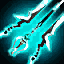 | [[wiki/items/11017-magical-wrath-blade\|Magical Wrath Blade]] | Weapon (31) | 0 |
|  | [[wiki/items/11002-magical-life-wand\|Magical Life Wand]] | Weapon (31) | 0 |
|  | [[wiki/items/11000-magical-storm-wand\|Magical Storm Wand]] | Weapon (31) | 0 |
|  | [[wiki/items/11001-magical-thunder-wand\|Magical Thunder Wand]] | Weapon (31) | 0 |
| 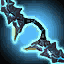 | [[wiki/items/16004-magical-frost-bow\|Magical Frost Bow]] | Weapon (31) | 0 |
|  | [[wiki/items/16007-magical-judge-dagger\|Magical judge Dagger]] | Weapon (31) | 0 |
| 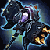 | [[wiki/items/21001-magical-demolition-hammer\|Magical Demolition Hammer]] | Weapon (31) | 0 |
| 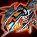 | [[wiki/items/21011-magical-blast-cannon\|Magical Blast Cannon]] | Weapon (31) | 0 |
| 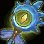 | [[wiki/items/10004-tempest-s-magical-wand\|Tempest's magical wand]] | Weapon (31) | 1 |
| 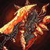 | [[wiki/items/10005-magical-blade-shield-flame\|Magical Blade Shield : Flame]] | Weapon (31) | 1 |
|  | [[wiki/items/10014-skeleton-king-s-magic-gun\|Skeleton king's Magic Gun]] | Weapon (31) | 1 |
| 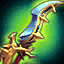 | [[wiki/items/15009-skeleton-king-s-magic-dagger\|Skeleton King's Magic Dagger]] | Weapon (31) | 1 |
| 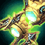 | [[wiki/items/20014-skeleton-king-s-magic-cannon\|Skeleton King's Magic Cannon]] | Weapon (31) | 1 |
| 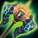 | [[wiki/items/20004-skeleton-king-s-magic-hammer\|Skeleton King's Magic Hammer]] | Weapon (31) | 1 |
|  | [[wiki/items/10004-tempest-s-magical-wand\|Tempest's magical wand]] | Weapon (31) | 2 |
|  | [[wiki/items/10005-magical-blade-shield-flame\|Magical Blade Shield : Flame]] | Weapon (31) | 2 |
|  | [[wiki/items/10014-skeleton-king-s-magic-gun\|Skeleton king's Magic Gun]] | Weapon (31) | 2 |
|  | [[wiki/items/15009-skeleton-king-s-magic-dagger\|Skeleton King's Magic Dagger]] | Weapon (31) | 2 |
|  | [[wiki/items/20014-skeleton-king-s-magic-cannon\|Skeleton King's Magic Cannon]] | Weapon (31) | 2 |
|  | [[wiki/items/20004-skeleton-king-s-magic-hammer\|Skeleton King's Magic Hammer]] | Weapon (31) | 2 |
|  | [[wiki/items/15005-skeleton-king-s-vision-bow\|Skeleton king's Vision Bow]] | Weapon (31) | 2 |

#### Grade 3 (69)

|  | item | kind | c3 |
|---|---|---|---|
| 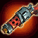 | [[wiki/items/10011-magical-adapted-dual-gun\|Magical adapted Dual Gun]] | Weapon (31) | 0 |
|  | [[wiki/items/10017-magical-wrath-blade\|Magical Wrath Blade]] | Weapon (31) | 0 |
|  | [[wiki/items/10002-magical-life-wand\|Magical Life Wand]] | Weapon (31) | 0 |
|  | [[wiki/items/10000-magical-storm-wand\|Magical Storm Wand]] | Weapon (31) | 0 |
|  | [[wiki/items/10001-magical-thunder-wand\|Magical Thunder Wand]] | Weapon (31) | 0 |
|  | [[wiki/items/15004-magical-frost-bow\|Magical Frost Bow]] | Weapon (31) | 0 |
| 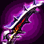 | [[wiki/items/15007-magical-judge-dagger\|Magical judge Dagger]] | Weapon (31) | 0 |
|  | [[wiki/items/20001-magical-demolition-hammer\|Magical Demolition Hammer]] | Weapon (31) | 0 |
|  | [[wiki/items/20011-magical-blast-cannon\|Magical Blast Cannon]] | Weapon (31) | 0 |
|  | [[wiki/items/10003-magical-cystal-wand\|Magical Cystal Wand]] | Weapon (31) | 0 |
| 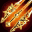 | [[wiki/items/10015-magical-dash-blade\|Magical Dash Blade]] | Weapon (31) | 0 |
|  | [[wiki/items/10020-magical-devil-wand\|Magical Devil Wand]] | Weapon (31) | 0 |
| 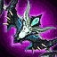 | [[wiki/items/15000-magical-shadow-bow\|Magical Shadow Bow]] | Weapon (31) | 0 |
|  | [[wiki/items/15001-magical-sniping-bow\|Magical Sniping Bow]] | Weapon (31) | 0 |
|  | [[wiki/items/15002-magical-vision-bow\|Magical Vision Bow]] | Weapon (31) | 0 |
| 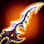 | [[wiki/items/15006-magical-blood-dagger\|Magical Blood Dagger]] | Weapon (31) | 0 |
|  | [[wiki/items/15008-magical-hiding-dagger\|Magical hiding Dagger]] | Weapon (31) | 0 |
|  | [[wiki/items/20020-magical-protect-hammer\|Magical Protect Hammer]] | Weapon (31) | 0 |
|  | [[wiki/items/20021-magical-protect-cannon\|Magical Protect Cannon]] | Weapon (31) | 0 |
|  | [[wiki/items/20002-magical-dash-hammer\|Magical Dash Hammer]] | Weapon (31) | 0 |
|  | [[wiki/items/20003-magical-crush-hammer\|Magical Crush Hammer]] | Weapon (31) | 0 |
|  | [[wiki/items/20015-magical-protect-mace\|Magical Protect Mace]] | Weapon (31) | 0 |
|  | [[wiki/items/10003-magical-cystal-wand\|Magical Cystal Wand]] | Weapon (31) | 1 |
|  | [[wiki/items/10015-magical-dash-blade\|Magical Dash Blade]] | Weapon (31) | 1 |
|  | [[wiki/items/10020-magical-devil-wand\|Magical Devil Wand]] | Weapon (31) | 1 |
|  | [[wiki/items/15000-magical-shadow-bow\|Magical Shadow Bow]] | Weapon (31) | 1 |
|  | [[wiki/items/15001-magical-sniping-bow\|Magical Sniping Bow]] | Weapon (31) | 1 |
|  | [[wiki/items/15002-magical-vision-bow\|Magical Vision Bow]] | Weapon (31) | 1 |
|  | [[wiki/items/15006-magical-blood-dagger\|Magical Blood Dagger]] | Weapon (31) | 1 |
|  | [[wiki/items/15008-magical-hiding-dagger\|Magical hiding Dagger]] | Weapon (31) | 1 |
|  | [[wiki/items/20020-magical-protect-hammer\|Magical Protect Hammer]] | Weapon (31) | 1 |
|  | [[wiki/items/20021-magical-protect-cannon\|Magical Protect Cannon]] | Weapon (31) | 1 |
|  | [[wiki/items/20002-magical-dash-hammer\|Magical Dash Hammer]] | Weapon (31) | 1 |
|  | [[wiki/items/20003-magical-crush-hammer\|Magical Crush Hammer]] | Weapon (31) | 1 |
|  | [[wiki/items/20015-magical-protect-mace\|Magical Protect Mace]] | Weapon (31) | 1 |
|  | [[wiki/items/11000-magical-storm-wand\|Magical Storm Wand]] | Weapon (31) | 1 |
|  | [[wiki/items/11001-magical-thunder-wand\|Magical Thunder Wand]] | Weapon (31) | 1 |
|  | [[wiki/items/11002-magical-life-wand\|Magical Life Wand]] | Weapon (31) | 1 |
|  | [[wiki/items/11003-magical-cystal-wand\|Magical Cystal Wand]] | Weapon (31) | 1 |
|  | [[wiki/items/11011-magical-adapted-dual-gun\|Magical adapted Dual Gun]] | Weapon (31) | 1 |
|  | [[wiki/items/11015-magical-dash-blade\|Magical Dash Blade]] | Weapon (31) | 1 |
|  | [[wiki/items/11017-magical-wrath-blade\|Magical Wrath Blade]] | Weapon (31) | 1 |
|  | [[wiki/items/11020-magical-devil-wand\|Magical Devil Wand]] | Weapon (31) | 1 |
|  | [[wiki/items/16000-magical-shadow-bow\|Magical Shadow Bow]] | Weapon (31) | 1 |
|  | [[wiki/items/16001-magical-sniping-bow\|Magical Sniping Bow]] | Weapon (31) | 1 |
|  | [[wiki/items/16002-magical-vision-bow\|Magical Vision Bow]] | Weapon (31) | 1 |
|  | [[wiki/items/16004-magical-frost-bow\|Magical Frost Bow]] | Weapon (31) | 1 |
|  | [[wiki/items/16006-magical-blood-dagger\|Magical Blood Dagger]] | Weapon (31) | 1 |
|  | [[wiki/items/16007-magical-judge-dagger\|Magical judge Dagger]] | Weapon (31) | 1 |
| 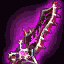 | [[wiki/items/16008-magical-hiding-dagger\|Magical hiding Dagger]] | Weapon (31) | 1 |
|  | [[wiki/items/21001-magical-demolition-hammer\|Magical Demolition Hammer]] | Weapon (31) | 1 |
| 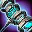 | [[wiki/items/21002-magical-dash-hammer\|Magical Dash Hammer]] | Weapon (31) | 1 |
|  | [[wiki/items/21003-magical-crush-hammer\|Magical Crush Hammer]] | Weapon (31) | 1 |
|  | [[wiki/items/21011-magical-blast-cannon\|Magical Blast Cannon]] | Weapon (31) | 1 |
|  | [[wiki/items/21015-magical-protect-mace\|Magical Protect Mace]] | Weapon (31) | 1 |
| 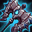 | [[wiki/items/21020-magical-protect-hammer\|Magical Protect Hammer]] | Weapon (31) | 1 |
|  | [[wiki/items/21021-magical-protect-cannon\|Magical Protect Cannon]] | Weapon (31) | 1 |
|  | [[wiki/items/641-rainbow-reinforcing-stone-weapon\|Rainbow Reinforcing Stone (Weapon)]] | Grede Reinforcing Stone (48) | 1 |
|  | [[wiki/items/643-rainbow-reinforcing-stone-weapon\|Rainbow Reinforcing Stone (Weapon)]] | Grede Reinforcing Stone (48) | 1 |
| 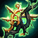 | [[wiki/items/30002-magical-life-wand\|Magical Life Wand]] | Weapon (31) | 1 |
| 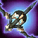 | [[wiki/items/35002-magical-vision-bow\|Magical Vision Bow]] | Weapon (31) | 1 |
|  | [[wiki/items/35009-skeleton-king-s-magic-dagger\|Skeleton King's Magic Dagger]] | Weapon (31) | 1 |
|  | [[wiki/items/40014-skeleton-king-s-magic-cannon\|Skeleton King's Magic Cannon]] | Weapon (31) | 1 |
|  | [[wiki/items/641-rainbow-reinforcing-stone-weapon\|Rainbow Reinforcing Stone (Weapon)]] | Grede Reinforcing Stone (48) | 2 |
|  | [[wiki/items/643-rainbow-reinforcing-stone-weapon\|Rainbow Reinforcing Stone (Weapon)]] | Grede Reinforcing Stone (48) | 2 |
|  | [[wiki/items/30002-magical-life-wand\|Magical Life Wand]] | Weapon (31) | 2 |
|  | [[wiki/items/35002-magical-vision-bow\|Magical Vision Bow]] | Weapon (31) | 2 |
|  | [[wiki/items/35009-skeleton-king-s-magic-dagger\|Skeleton King's Magic Dagger]] | Weapon (31) | 2 |
|  | [[wiki/items/40014-skeleton-king-s-magic-cannon\|Skeleton King's Magic Cannon]] | Weapon (31) | 2 |

### Odds

Not in the client (`Gacha_NN` has items and grades only). The contract's `gacha_odds` suggestion (uniform within a grade, grade weights 70/25/5) is invented, not original data. Put real odds in `odds:` with a source.

### Seen in

- Seen in [[gameplay/README|Gameplay]], section *Pages*
- Seen in [[gameplay/classes-and-legions|Classes, nations and legions]], section *1. Classes*
- Seen in [[gameplay/events-and-schedules|Events, schedules and PvP rewards]], section *9. Other timers and limits*
- Seen in [[gameplay/items-and-crafting|Items, upgrades and crafting]], section *5. Where gear comes from*
- Seen in [[gameplay/patch-history|Patch notes and other sources]], section *Economy and timeline*
- Seen in [[gameplay/progression-and-economy|Progression and economy]], section *3. Currencies*
- Seen in [[gameplay/reinforce-and-runes|Reinforce, tier-up and rune numbers]], section *4. Gear reinforce and tier-up*
- Seen in [[gameplay/server-rules|Server rules checklist]], section *Economy*
- Seen in [[gameplay/sources|Sources and gaps]], section *9. What is still missing*
- Seen in [[gameplay/videos|Videos]], section *Wars, forts and matches*
<!-- generated:end -->

## Notes

Paid card (Weapon (tiers 2–3)). Spring 2018 guides show the paid cards Artifact 1,000, Weapon 2,000 and Innocence 2,000 jewels, plus a second row of the same three at 10,000 each (multi-draw, *guess*), payable with purple or yellow jewels ([[gameplay/progression-and-economy|Progression and economy]] §6, *image + guide*). Gacha gear was described as small stat boosts, not pay-to-win. Superior weapons also came from the Weapon gacha (WM 0920, [[gameplay/reinforce-and-runes|Reinforce and runes]] §4, *notes*).

## Behaviour

<!-- hand-written: add what you know, with a source -->

## Sources

- image + guide: [[gameplay/progression-and-economy]] §6 (paid cards Artifact 1,000 / Weapon 2,000 / Innocence 2,000 jewels, a second row at 10,000; purple or yellow jewels) + notes: [[gameplay/events-and-schedules]] §10 (WM 1018 pools, odds never published)

## Open questions

Odds were never published and the client pools have no odds column ([[gameplay/events-and-schedules|Events and schedules]] §10); the contract's gacha_odds are invented. Counting draws in a video is the only lead ([[gameplay/sources|Sources]], open item 10).

<!-- credit:start -->
---
*Game content © GAMESinFLAMES / Joyimpact; reproduced for preservation and reference.*
<!-- credit:end -->
