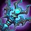

<!-- generated:start -->
<!-- generated-keys: title=3f4fa2 type=d36ca9 id=6c447a sources=cfee0f name_key=67c239 kind=632667 kind_name=631b4f classes=30141f bind=883bf8 price=6961f8 cost_pair=5b5722 weapon_base=da4b92 stats=977f84 options=48596c skills=309bef reinforce=17ba07 icon=df9804 obtained_from=e6ef62 -->
|  |  |
|---|---|
|  |  |
| **Item id** | `10001` |
| **Kind** | Weapon (31) |
| **Classes** | Saint |
| **Bind** | on pickup |
| **Buy price** | 500 Gold |
| **Icon** | `ui/icons/Weapon_PCE_01.dds` cell 33 |

### Stats

Weapon and armour stats grow with the item: the client multiplies the first three option slots by *tier × 15 + reinforce level* and the next three by the *tier*; the rest are flat (`FUN_004410d6`, *client*; reading of the two multipliers is *inferred*).

| stat | value | applies | code |
|---|---|---|---|
| Attack | +2 | × (tier × 15 + reinforce level) | 1 |
| Ability Power | +8 | × (tier × 15 + reinforce level) | 2 |
| Ability Power | +10 | × tier | 2 |

### Other options

| code | value | meaning |
|---|---|---|
| 200 | 2 | WeaponBase row |

### Weapon base

WeaponBase row 2. The client adds these to the wielder's stats (`FUN_004410d6`; which stat each one is, is not decoded yet): `c2` = 80, `c3` = 100, `c4` = 750, `c5` = 300.

### Weapon skills

Weapon base 2. Skills 1–4 are the normal Q/W/E/R skills, 5–8 the hero (transformed) ones.

1. [[wiki/skills/5004-thunderbolt|Thunderbolt]]
2. [[wiki/skills/5005-lightning-strike|Lightning Strike]]
3. [[wiki/skills/5006-ball-of-lighting|Ball of Lighting]]
4. [[wiki/skills/5007-might-of-thunder-god|Might of Thunder God]]

### Reinforcement

ItemSancMet row 11 (inferred from Item_Base +0x92), 1,000 gold per attempt. Success rates are not in the client.

| step | materials |
|---|---|
| 1 | [[wiki/items/611-red-passion-fragments-d\|Red Passion Fragments (D)]] × 1 |
| 2 | [[wiki/items/612-red-passion-piece-d\|Red Passion Piece (D)]] × 1 |
| 3 | [[wiki/items/613-red-passion-fragments-c\|Red Passion Fragments (C)]] × 2 |
| 4 | [[wiki/items/614-red-passion-piece-c\|Red Passion Piece (C)]] × 3 |
| 5 | [[wiki/items/615-red-passion-fragments-b\|Red Passion Fragments (B)]] × 7 |
| 6 | [[wiki/items/616-red-passion-piece-b\|Red Passion Piece (B)]] × 8 |

### Crafting

| recipe | materials | gold | success % |
|---|---|---|---|
| 919 | [[wiki/items/854-shining-passion\|Shining Passion]] × 3, [[wiki/items/700-crystal-blue\|Crystal : Blue]] × 50 | 0 | 100 |
| 2207 | [[wiki/items/854-shining-passion\|Shining Passion]] × 3, [[wiki/items/700-crystal-blue\|Crystal : Blue]] × 50 | 0 | 100 |

### Where to get it

- Reward of quest [[wiki/quests/80-support-the-abyss-expedition|Support the Abyss expedition]] × 1
- Reward of quest [[wiki/quests/769-group-border-area-hard-mode|Group - Border Area Hard Mode]] × 1
- In random box table row 1 (RandomBox.cdb; odds are server side)
- Hero gacha pool 00, grade 3 (Gacha_00.cdb; odds are server side)
- Hero gacha pool 02, grade 3 (Gacha_02.cdb; odds are server side)
- Hero gacha pool 05, grade 3 (Gacha_05.cdb; odds are server side)

### Mentioned in

- [[gameplay/classes-and-legions|Classes, nations and legions]]
- [[gameplay/video-character-creation-and-tutorial|Video notes: character creation and tutorial (ZonderCoRe, June 2018)]]
<!-- generated:end -->

## Notes

<!-- hand-written: add what you know, with a source -->

## Behaviour

<!-- hand-written: add what you know, with a source -->

## Sources

<!-- hand-written: add what you know, with a source -->

## Open questions

<!-- hand-written: add what you know, with a source -->

<!-- credit:start -->
---
*Game content © GAMESinFLAMES / Joyimpact; reproduced for preservation and reference.*
<!-- credit:end -->
