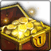

<!-- generated:start -->
<!-- generated-keys: title=7a013a type=d36ca9 id=00e263 sources=b0f005 name_key=f348e0 kind=5a5b0f kind_name=7a013a classes=92d079 bind=2be88c price=32a324 cost_pair=395e20 stats=97d170 icon=119348 obtained_from=429217 -->
|  |  |
|---|---|
|  |  |
| **Item id** | `1021` |
| **Kind** | Gold (59) |
| **Classes** | all |
| **Buy price** | 0 Gold |
| **Icon** | `ui/icons/Items_08.png` cell 10 |

### Tooltip

> Click right mouse button, get gold.

### Where to get it

- In random box table row 46 (RandomBox.cdb; odds are server side)
- In random box table row 47 (RandomBox.cdb; odds are server side)
- In random box table row 48 (RandomBox.cdb; odds are server side)
- In random box table row 49 (RandomBox.cdb; odds are server side)
- In random box table row 50 (RandomBox.cdb; odds are server side)
- In random box table row 51 (RandomBox.cdb; odds are server side)
<!-- generated:end -->

## Notes

<!-- hand-written: add what you know, with a source -->

## Behaviour

<!-- hand-written: add what you know, with a source -->

## Sources

<!-- hand-written: add what you know, with a source -->

## Open questions

<!-- hand-written: add what you know, with a source -->

<!-- credit:start -->
---
*Game content © GAMESinFLAMES / Joyimpact; reproduced for preservation and reference.*
<!-- credit:end -->
