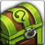

<!-- generated:start -->
<!-- generated-keys: title=f300bc type=d36ca9 id=2b669c sources=0b2bfc name_key=3b4e5d kind=0286dd kind_name=b98f11 classes=92d079 bind=2be88c price=91d472 cost_pair=9f4cde flags=1b6453 no_sell=7cb6ef stats=97d170 icon=622ed3 obtained_from=506632 -->
|  |  |
|---|---|
|  |  |
| **Item id** | `1059` |
| **Kind** | Random Box (43) |
| **Classes** | all |
| **Buy price** | 3 Bronze Medal |
| **Icon** | `ui/icons/Items_01.png` cell 17 |

### Where to get it

- Sold in [[wiki/shops/283-athan-s-shop-merits-merchant|Athan's shop (Merits Merchant)]] ([[wiki/npcs/207-athan|Athan]])

### Mentioned in

- [[gameplay/progression-and-economy|Progression and economy]]
<!-- generated:end -->

## Notes

Athan sold three kinds of Random box of dye for **3 bronze/silver** medals ([[gameplay/progression-and-economy|Progression and economy]] §4, *image*).

## Behaviour

<!-- hand-written: add what you know, with a source -->

## Sources

- image: [[gameplay/progression-and-economy]] §4

## Open questions

<!-- hand-written: add what you know, with a source -->

<!-- credit:start -->
---
*Game content © GAMESinFLAMES / Joyimpact; reproduced for preservation and reference.*
<!-- credit:end -->
