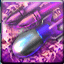

<!-- generated:start -->
<!-- generated-keys: title=6452b6 type=d36ca9 id=fbce66 sources=7df46a name_key=b72ec8 kind=e6c3dd kind_name=346307 classes=92d079 bind=2be88c price=8c6ae2 cost_pair=982f5a stats=97d170 options=a02fd5 icon=b5c79c obtained_from=fb86f4 -->
|  |  |
|---|---|
|  |  |
| **Item id** | `1414` |
| **Kind** | Legion Core (60) |
| **Classes** | all |
| **Buy price** | 10 Gold |
| **Icon** | `ui/icons/Policy_01.png` cell 25 |

### Tooltip

> Powerful Remote Bomb
>
> PvP : It attacks the Nexus after destroying all of the enemy's attacking towers.
> PvE : When using, attack all bosses after attacking the middle boss.

### Other options

| code | value | meaning |
|---|---|---|
| 461 | 15 | unknown |
| 461 | 17 | unknown |

### Crafting

| recipe | materials | gold | success % |
|---|---|---|---|
| 1913 | [[wiki/items/859-brilliant-core-stone\|Brilliant core stone]] × 1, [[wiki/items/602-blue-passion-piece-d\|Blue Passion Piece (D)]] × 25, [[wiki/items/612-red-passion-piece-d\|Red Passion Piece (D)]] × 25 | 0 | 100 |

### Where to get it

Nothing in the client data. Monster drops are server data: add them to the monster's page (`drops:`) or to this page's `obtained_from:`.

### Mentioned in

- [[gameplay/events-and-schedules|Events, schedules and PvP rewards]]
- [[gameplay/pvp-and-matches|PvP, land wars and matches]]
- [[gameplay/server-rules|Server rules checklist]]
- [[gameplay/video-fort-war|Video notes: fortress war series (ZonderCoRe)]]
<!-- generated:end -->

## Notes

<!-- hand-written: add what you know, with a source -->

## Behaviour

<!-- hand-written: add what you know, with a source -->

## Sources

<!-- hand-written: add what you know, with a source -->

## Open questions

<!-- hand-written: add what you know, with a source -->

<!-- credit:start -->
---
*Game content © GAMESinFLAMES / Joyimpact; reproduced for preservation and reference.*
<!-- credit:end -->
