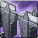

<!-- generated:start -->
<!-- generated-keys: title=00cccd type=d36ca9 id=2121f1 sources=cf6267 name_key=19062d kind=cb7a1d kind_name=c29b8b classes=92d079 bind=2be88c price=936627 cost_pair=ebf7c2 stats=718df7 icon=5981f7 obtained_from=97d170 -->
|  |  |
|---|---|
|  |  |
| **Item id** | `1606` |
| **Kind** | Holy Things (37) |
| **Classes** | all |
| **Buy price** | 100 Gold |
| **Icon** | `ui/icons/Policy.png` cell 26 |

### Tooltip

> [Active]Hide the fort location on the world map.
> When move to other area, hiding is unveiled.

### Stats

| stat | value | applies | code |
|---|---|---|---|
| option 26 | +20 | flat | 26 |

### Where to get it

Nothing in the client data. Monster drops are server data: add them to the monster's page (`drops:`) or to this page's `obtained_from:`.
<!-- generated:end -->

## Notes

<!-- hand-written: add what you know, with a source -->

## Behaviour

<!-- hand-written: add what you know, with a source -->

## Sources

<!-- hand-written: add what you know, with a source -->

## Open questions

<!-- hand-written: add what you know, with a source -->

<!-- credit:start -->
---
*Game content © GAMESinFLAMES / Joyimpact; reproduced for preservation and reference.*
<!-- credit:end -->
