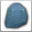

<!-- generated:start -->
<!-- generated-keys: title=8249f4 type=d36ca9 id=31fb9f sources=972411 name_key=a008dd kind=356a19 kind_name=6f63d6 classes=92d079 bind=2be88c price=936627 cost_pair=ebf7c2 stats=97d170 icon=3b8774 obtained_from=5f90c5 -->
|  |  |
|---|---|
|  |  |
| **Item id** | `1901` |
| **Kind** | Normal (1) |
| **Classes** | all |
| **Buy price** | 100 Gold |
| **Icon** | `ui/icons/Items_01.png` cell 36 |

### Tooltip

> For sale

### Where to get it

- Sold in [[wiki/shops/40-shop-40-no-npc|Shop 40 (no NPC)]] (no NPC found)
- Sold in [[wiki/shops/41-shop-41-no-npc|Shop 41 (no NPC)]] (no NPC found)
- Sold in [[wiki/shops/43-shop-43-no-npc|Shop 43 (no NPC)]] (no NPC found)
- Sold in [[wiki/shops/44-shop-44-no-npc|Shop 44 (no NPC)]] (no NPC found)
- Sold in [[wiki/shops/45-shop-45-no-npc|Shop 45 (no NPC)]] (no NPC found)
- Sold in [[wiki/shops/47-shop-47-no-npc|Shop 47 (no NPC)]] (no NPC found)
- Sold in [[wiki/shops/48-shop-48-no-npc|Shop 48 (no NPC)]] (no NPC found)
- Sold in [[wiki/shops/49-shop-49-no-npc|Shop 49 (no NPC)]] (no NPC found)
- Sold in [[wiki/shops/51-shop-51-no-npc|Shop 51 (no NPC)]] (no NPC found)
- Sold in [[wiki/shops/52-shop-52-no-npc|Shop 52 (no NPC)]] (no NPC found)
- Sold in [[wiki/shops/53-shop-53-no-npc|Shop 53 (no NPC)]] (no NPC found)
- Sold in [[wiki/shops/55-shop-55-no-npc|Shop 55 (no NPC)]] (no NPC found)
- Sold in [[wiki/shops/56-shop-56-no-npc|Shop 56 (no NPC)]] (no NPC found)
- Sold in [[wiki/shops/59-shop-59-no-npc|Shop 59 (no NPC)]] (no NPC found)
- Sold in [[wiki/shops/60-shop-60-no-npc|Shop 60 (no NPC)]] (no NPC found)
- Sold in [[wiki/shops/85-shop-85-no-npc|Shop 85 (no NPC)]] (no NPC found)
- Sold in [[wiki/shops/86-shop-86-no-npc|Shop 86 (no NPC)]] (no NPC found)
- Sold in [[wiki/shops/88-shop-88-no-npc|Shop 88 (no NPC)]] (no NPC found)
- Sold in [[wiki/shops/89-shop-89-no-npc|Shop 89 (no NPC)]] (no NPC found)
- Sold in [[wiki/shops/90-shop-90-no-npc|Shop 90 (no NPC)]] (no NPC found)
- Sold in [[wiki/shops/92-shop-92-no-npc|Shop 92 (no NPC)]] (no NPC found)
- Sold in [[wiki/shops/93-shop-93-no-npc|Shop 93 (no NPC)]] (no NPC found)
- Sold in [[wiki/shops/94-shop-94-no-npc|Shop 94 (no NPC)]] (no NPC found)
- Sold in [[wiki/shops/96-shop-96-no-npc|Shop 96 (no NPC)]] (no NPC found)
- Sold in [[wiki/shops/97-shop-97-no-npc|Shop 97 (no NPC)]] (no NPC found)
- Sold in [[wiki/shops/98-shop-98-no-npc|Shop 98 (no NPC)]] (no NPC found)
- Sold in [[wiki/shops/100-shop-100-no-npc|Shop 100 (no NPC)]] (no NPC found)
- Sold in [[wiki/shops/101-shop-101-no-npc|Shop 101 (no NPC)]] (no NPC found)
- Sold in [[wiki/shops/104-shop-104-no-npc|Shop 104 (no NPC)]] (no NPC found)
- Sold in [[wiki/shops/211-shop-211-no-npc|Shop 211 (no NPC)]] (no NPC found)
- Sold in [[wiki/shops/212-shop-212-no-npc|Shop 212 (no NPC)]] (no NPC found)
- Sold in [[wiki/shops/213-shop-213-no-npc|Shop 213 (no NPC)]] (no NPC found)
- Sold in [[wiki/shops/214-shop-214-no-npc|Shop 214 (no NPC)]] (no NPC found)
- Sold in [[wiki/shops/215-shop-215-no-npc|Shop 215 (no NPC)]] (no NPC found)
- Sold in [[wiki/shops/216-shop-216-no-npc|Shop 216 (no NPC)]] (no NPC found)
- Sold in [[wiki/shops/231-shop-231-no-npc|Shop 231 (no NPC)]] (no NPC found)
- Sold in [[wiki/shops/232-shop-232-no-npc|Shop 232 (no NPC)]] (no NPC found)
- Sold in [[wiki/shops/233-shop-233-no-npc|Shop 233 (no NPC)]] (no NPC found)
- Sold in [[wiki/shops/234-shop-234-no-npc|Shop 234 (no NPC)]] (no NPC found)
- Sold in [[wiki/shops/301-shop-301-no-npc|Shop 301 (no NPC)]] (no NPC found)
- Sold in [[wiki/shops/302-shop-302-no-npc|Shop 302 (no NPC)]] (no NPC found)
- Sold in [[wiki/shops/303-shop-303-no-npc|Shop 303 (no NPC)]] (no NPC found)

### Mentioned in

- [[gameplay/video-dungeon-run|Video notes: Nas Village dungeon run (ZonderCoRe)]]
<!-- generated:end -->

## Notes

<!-- hand-written: add what you know, with a source -->

## Behaviour

<!-- hand-written: add what you know, with a source -->

## Sources

<!-- hand-written: add what you know, with a source -->

## Open questions

<!-- hand-written: add what you know, with a source -->

<!-- credit:start -->
---
*Game content © GAMESinFLAMES / Joyimpact; reproduced for preservation and reference.*
<!-- credit:end -->
