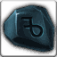

<!-- generated:start -->
<!-- generated-keys: title=927092 type=d36ca9 id=6d3211 sources=8106f3 name_key=f017bf kind=356a19 kind_name=6f63d6 classes=92d079 bind=2be88c price=c4f310 cost_pair=809c9f stats=97d170 icon=f0bf28 obtained_from=1fc6e4 -->
|  |  |
|---|---|
|  |  |
| **Item id** | `1905` |
| **Kind** | Normal (1) |
| **Classes** | all |
| **Buy price** | 80 Gold |
| **Icon** | `ui/icons/Items_08.png` cell 2 |

### Tooltip

> For sale

### Where to get it

- Sold in [[wiki/shops/108-shop-108-no-npc|Shop 108 (no NPC)]] (no NPC found)
- Sold in [[wiki/shops/110-shop-110-no-npc|Shop 110 (no NPC)]] (no NPC found)
<!-- generated:end -->

## Notes

<!-- hand-written: add what you know, with a source -->

## Behaviour

<!-- hand-written: add what you know, with a source -->

## Sources

<!-- hand-written: add what you know, with a source -->

## Open questions

<!-- hand-written: add what you know, with a source -->

<!-- credit:start -->
---
*Game content © GAMESinFLAMES / Joyimpact; reproduced for preservation and reference.*
<!-- credit:end -->
