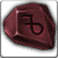

<!-- generated:start -->
<!-- generated-keys: title=9f2cce type=d36ca9 id=8b92eb sources=16cffc name_key=d6f07b kind=356a19 kind_name=6f63d6 classes=92d079 bind=2be88c price=80fa96 cost_pair=e76c7b stats=97d170 icon=13e016 obtained_from=1fc6e4 -->
|  |  |
|---|---|
|  |  |
| **Item id** | `1908` |
| **Kind** | Normal (1) |
| **Classes** | all |
| **Buy price** | 20 Gold |
| **Icon** | `ui/icons/Items_08.png` cell 5 |

### Tooltip

> For sale

### Where to get it

- Sold in [[wiki/shops/108-shop-108-no-npc|Shop 108 (no NPC)]] (no NPC found)
- Sold in [[wiki/shops/110-shop-110-no-npc|Shop 110 (no NPC)]] (no NPC found)
<!-- generated:end -->

## Notes

<!-- hand-written: add what you know, with a source -->

## Behaviour

<!-- hand-written: add what you know, with a source -->

## Sources

<!-- hand-written: add what you know, with a source -->

## Open questions

<!-- hand-written: add what you know, with a source -->

<!-- credit:start -->
---
*Game content © GAMESinFLAMES / Joyimpact; reproduced for preservation and reference.*
<!-- credit:end -->
