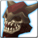

<!-- generated:start -->
<!-- generated-keys: title=7a1bd5 type=d36ca9 id=abfee6 sources=28eeca name_key=1d61eb kind=0716d9 kind_name=a42e2b classes=92d079 bind=883bf8 price=80fa96 cost_pair=e76c7b stats=97d170 icon=b39509 obtained_from=72e614 -->
|  |  |
|---|---|
|  |  |
| **Item id** | `2657` |
| **Kind** | Quest (17) |
| **Classes** | all |
| **Bind** | on pickup |
| **Buy price** | 20 Gold |
| **Icon** | `ui/icons/Items_05.png` cell 30 |

### Tooltip

> Quest Item

### Where to get it

- Quest drop: Object 10010 drops it at 100% during [[wiki/quests/1006-skull-temple-hunting|Skull Temple : Hunting]] (need 5)

### Mentioned in

- [[gameplay/video-character-creation-and-tutorial|Video notes: character creation and tutorial (ZonderCoRe, June 2018)]]
- [[gameplay/video-early-quests|Video notes: first session, levels 1+ (charmanmugen)]]
- [[gameplay/video-tutorial-walkthrough|Video notes: tutorial walkthrough (Bravely Forward 2)]]
<!-- generated:end -->

## Notes

<!-- hand-written: add what you know, with a source -->

## Behaviour

<!-- hand-written: add what you know, with a source -->

## Sources

<!-- hand-written: add what you know, with a source -->

## Open questions

<!-- hand-written: add what you know, with a source -->

<!-- credit:start -->
---
*Game content © GAMESinFLAMES / Joyimpact; reproduced for preservation and reference.*
<!-- credit:end -->
