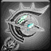

<!-- generated:start -->
<!-- generated-keys: title=56aa04 type=d36ca9 id=794cd5 sources=c034c5 name_key=c3b0af kind=7b5200 kind_name=59f0ad classes=92d079 bind=2be88c price=6961f8 cost_pair=5b5722 stats=97d170 icon=7a239b obtained_from=0059e7 -->
|  |  |
|---|---|
|  |  |
| **Item id** | `2759` |
| **Kind** | Material (12) |
| **Classes** | all |
| **Buy price** | 500 Gold |
| **Icon** | `ui/icons/Weapon_Item.png` cell 0 |

### Tooltip

> Chepa Sorcerer's Sealed Weapon

### Where to get it

- Sold in [[wiki/shops/30-shop-30-no-npc|Shop 30 (no NPC)]] (no NPC found)
- Sold in [[wiki/shops/75-shop-75-no-npc|Shop 75 (no NPC)]] (no NPC found)
- Shown as a reward of dungeon [[wiki/dungeons/127-lv-1-chepa-village|(Lv 1) Chepa Village]]
<!-- generated:end -->

## Notes

<!-- hand-written: add what you know, with a source -->

## Behaviour

<!-- hand-written: add what you know, with a source -->

## Sources

<!-- hand-written: add what you know, with a source -->

## Open questions

<!-- hand-written: add what you know, with a source -->

<!-- credit:start -->
---
*Game content © GAMESinFLAMES / Joyimpact; reproduced for preservation and reference.*
<!-- credit:end -->
