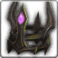

<!-- generated:start -->
<!-- generated-keys: title=8d1355 type=d36ca9 id=1d25ca sources=629e10 name_key=0e3c2f kind=e1822d kind_name=c90f98 classes=92d079 bind=883bf8 price=8c6ae2 cost_pair=982f5a rarity=356a19 stats=8dba95 set=da4b92 reinforce=92cfce icon=b14936 obtained_from=378c9e -->
|  |  |
|---|---|
|  |  |
| **Item id** | `3011` |
| **Kind** | Helmet (50) |
| **Classes** | all |
| **Bind** | on pickup |
| **Buy price** | 10 Gold |
| **Rarity (guessed column)** | 1 |
| **Set** | Set 2 |
| **Icon** | `ui/icons/Items_09.png` cell 13 |

### Stats

Weapon and armour stats grow with the item: the client multiplies the first three option slots by *tier × 15 + reinforce level* and the next three by the *tier*; the rest are flat (`FUN_004410d6`, *client*; reading of the two multipliers is *inferred*).

| stat | value | applies | code |
|---|---|---|---|
| Armor | +6 | × (tier × 15 + reinforce level) | 6 |
| Magic Resist | +3 | × (tier × 15 + reinforce level) | 7 |
| Health | +20 | × (tier × 15 + reinforce level) | 31 |
| Armor | +10 | × tier | 6 |
| Magic Resist | +10 | × tier | 7 |
| Health | +10 | × tier | 31 |
| Armor | +40 | flat | 6 |
| Magic Resist | +20 | flat | 7 |
| Mana | +75 | flat | 33 |
| Movement(%) | Movement +9% | flat | 105 |

### Set bonus

Pieces: [[wiki/items/3011-skull-s-helmet|Skull's Helmet]], [[wiki/items/3012-skull-s-armor|Skull's Armor]], [[wiki/items/3013-skull-s-gloves|Skull's Gloves]], [[wiki/items/3014-skull-s-shoes|Skull's Shoes]], [[wiki/items/3015-skull-s-necklace|Skull's Necklace]], [[wiki/items/3016-skull-s-belt|Skull's Belt]], [[wiki/items/3017-skull-s-bracelet|Skull's Bracelet]], [[wiki/items/3018-skull-s-ring|Skull's Ring]]

| pieces | bonus | value |
|---|---|---|
| 3 | Armor | +30 |
| 5 | Magic Resist | +30 |
| 8 | Armor | +50 |
| 8 | Magic Resist | +50 |

### Reinforcement

ItemSancMet row 42 (inferred from Item_Base +0x92), 5,000 gold per attempt. Success rates are not in the client.

| step | materials |
|---|---|
| 1 | [[wiki/items/602-blue-passion-piece-d\|Blue Passion Piece (D)]] × 6 |
| 2 | [[wiki/items/603-blue-passion-fragments-c\|Blue Passion Fragments (C)]] × 8 |
| 3 | [[wiki/items/604-blue-passion-piece-c\|Blue Passion Piece (C)]] × 8 |
| 4 | [[wiki/items/605-blue-passion-fragments-b\|Blue Passion Fragments (B)]] × 10 |
| 5 | [[wiki/items/606-blue-passion-piece-b\|Blue Passion Piece (B)]] × 10 |
| 6 | [[wiki/items/607-blue-passion-fragments-a\|Blue Passion Fragments (A)]] × 15 |

### Crafting

| recipe | materials | gold | success % |
|---|---|---|---|
| 309 | [[wiki/items/2702-skull-horn\|Skull Horn]] × 1, [[wiki/items/1930-essence-of-darkness\|essence of Darkness]] × 1 | 0 | 60 |

### Where to get it

- In random box table row 62 (RandomBox.cdb; odds are server side)
- Hero gacha pool 04, grade 2 (Gacha_04.cdb; odds are server side)

### Mentioned in

- [[gameplay/skull-artifact-set|Skull artifact set tooltips (Crush Online, Feb 2017)]]
<!-- generated:end -->

## Notes

<!-- hand-written: add what you know, with a source -->

## Behaviour

<!-- hand-written: add what you know, with a source -->

## Sources

<!-- hand-written: add what you know, with a source -->

## Open questions

<!-- hand-written: add what you know, with a source -->

<!-- credit:start -->
---
*Game content © GAMESinFLAMES / Joyimpact; reproduced for preservation and reference.*
<!-- credit:end -->
