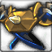

<!-- generated:start -->
<!-- generated-keys: title=61c9e7 type=d36ca9 id=9a0f09 sources=d8e5a6 name_key=109bed kind=b7eb6c kind_name=e687cb classes=92d079 bind=883bf8 price=8c6ae2 cost_pair=982f5a rarity=356a19 stats=b39e3f set=c1dfd9 reinforce=92cfce icon=f2360c obtained_from=878f71 -->
|  |  |
|---|---|
|  |  |
| **Item id** | `3052` |
| **Kind** | Armor (51) |
| **Classes** | all |
| **Bind** | on pickup |
| **Buy price** | 10 Gold |
| **Rarity (guessed column)** | 1 |
| **Set** | Set 6 |
| **Icon** | `ui/icons/Items_09.png` cell 61 |

### Stats

Weapon and armour stats grow with the item: the client multiplies the first three option slots by *tier × 15 + reinforce level* and the next three by the *tier*; the rest are flat (`FUN_004410d6`, *client*; reading of the two multipliers is *inferred*).

| stat | value | applies | code |
|---|---|---|---|
| Armor | +2 | × (tier × 15 + reinforce level) | 6 |
| Magic Resist | +1 | × (tier × 15 + reinforce level) | 7 |
| Health | +26 | × (tier × 15 + reinforce level) | 31 |
| Health | +20 | × tier | 31 |
| Mana | +10 | × tier | 33 |
| Armor | +22 | flat | 6 |
| Magic Resist | +11 | flat | 7 |
| Health | +250 | flat | 31 |
| Movement(%) | Movement +10% | flat | 105 |

### Set bonus

Pieces: [[wiki/items/3051-garon-s-helmet|Garon's Helmet]], [[wiki/items/3052-garon-s-armor|Garon's Armor]], [[wiki/items/3053-garon-s-gloves|Garon's Gloves]], [[wiki/items/3054-garon-s-shoes|Garon's Shoes]], [[wiki/items/3055-garon-s-orb|Garon's Orb]], [[wiki/items/3056-garon-s-belt|Garon's Belt]], [[wiki/items/3057-garon-s-bracelet|Garon's Bracelet]], [[wiki/items/3058-garon-s-ring|Garon's Ring]]

| pieces | bonus | value |
|---|---|---|
| 3 | Health | +300 |
| 5 | Health | +400 |
| 5 | Health Regeneration | +50 |
| 8 | Health | +600 |
| 8 | Health Regeneration | +70 |

### Reinforcement

ItemSancMet row 42 (inferred from Item_Base +0x92), 5,000 gold per attempt. Success rates are not in the client.

| step | materials |
|---|---|
| 1 | [[wiki/items/602-blue-passion-piece-d\|Blue Passion Piece (D)]] × 6 |
| 2 | [[wiki/items/603-blue-passion-fragments-c\|Blue Passion Fragments (C)]] × 8 |
| 3 | [[wiki/items/604-blue-passion-piece-c\|Blue Passion Piece (C)]] × 8 |
| 4 | [[wiki/items/605-blue-passion-fragments-b\|Blue Passion Fragments (B)]] × 10 |
| 5 | [[wiki/items/606-blue-passion-piece-b\|Blue Passion Piece (B)]] × 10 |
| 6 | [[wiki/items/607-blue-passion-fragments-a\|Blue Passion Fragments (A)]] × 15 |

### Crafting

| recipe | materials | gold | success % |
|---|---|---|---|
| 342 | [[wiki/items/2706-horn-of-garon\|Horn of Garon]] × 1, [[wiki/items/1934-essence-of-earth\|Essence of Earth]] × 1 | 0 | 60 |

### Where to get it

- In random box table row 66 (RandomBox.cdb; odds are server side)
- Hero gacha pool 04, grade 2 (Gacha_04.cdb; odds are server side)
<!-- generated:end -->

## Notes

<!-- hand-written: add what you know, with a source -->

## Behaviour

<!-- hand-written: add what you know, with a source -->

## Sources

<!-- hand-written: add what you know, with a source -->

## Open questions

<!-- hand-written: add what you know, with a source -->

<!-- credit:start -->
---
*Game content © GAMESinFLAMES / Joyimpact; reproduced for preservation and reference.*
<!-- credit:end -->
