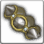

<!-- generated:start -->
<!-- generated-keys: title=099a7a type=d36ca9 id=6d0e10 sources=bccdbd name_key=6dd8e5 kind=9109c8 kind_name=8ad6b7 classes=92d079 bind=2be88c price=401276 cost_pair=7638f4 stats=a97839 reinforce=356a19 icon=34555f obtained_from=dc074e -->
|  |  |
|---|---|
|  |  |
| **Item id** | `440` |
| **Kind** | Ring (57) |
| **Classes** | all |
| **Buy price** | 120 Gold |
| **Icon** | `ui/icons/Items_06.png` cell 36 |

### Stats

Weapon and armour stats grow with the item: the client multiplies the first three option slots by *tier × 15 + reinforce level* and the next three by the *tier*; the rest are flat (`FUN_004410d6`, *client*; reading of the two multipliers is *inferred*).

| stat | value | applies | code |
|---|---|---|---|
| Armor | +2 | × (tier × 15 + reinforce level) | 6 |
| Magic Resist | +5 | × (tier × 15 + reinforce level) | 7 |
| Mana | +10 | × (tier × 15 + reinforce level) | 33 |
| Armor | +10 | × tier | 6 |
| Magic Resist | +10 | × tier | 7 |
| Mana | +10 | × tier | 33 |
| Armor | +55 | flat | 6 |
| Magic Resist | +40 | flat | 7 |
| Mana | +140 | flat | 33 |

### Reinforcement

ItemSancMet row 1 (inferred from Item_Base +0x92), 1,000 gold per attempt. Success rates are not in the client.

| step | materials |
|---|---|
| 1 | [[wiki/items/601-blue-passion-fragments-d\|Blue Passion Fragments (D)]] × 1 |
| 2 | [[wiki/items/602-blue-passion-piece-d\|Blue Passion Piece (D)]] × 1 |
| 3 | [[wiki/items/603-blue-passion-fragments-c\|Blue Passion Fragments (C)]] × 1 |
| 4 | [[wiki/items/604-blue-passion-piece-c\|Blue Passion Piece (C)]] × 2 |
| 5 | [[wiki/items/605-blue-passion-fragments-b\|Blue Passion Fragments (B)]] × 5 |
| 6 | [[wiki/items/606-blue-passion-piece-b\|Blue Passion Piece (B)]] × 7 |

### Crafting

| recipe | materials | gold | success % |
|---|---|---|---|
| 44 | [[wiki/items/700-crystal-blue\|Crystal : Blue]] × 21 | 315 | 100 |

### Where to get it

- Hero gacha pool 00, grade 1 (Gacha_00.cdb; odds are server side)
- Hero gacha pool 01, grade 3 (Gacha_01.cdb; odds are server side)
- Hero gacha pool 04, grade 3 (Gacha_04.cdb; odds are server side)
<!-- generated:end -->

## Notes

<!-- hand-written: add what you know, with a source -->

## Behaviour

<!-- hand-written: add what you know, with a source -->

## Sources

<!-- hand-written: add what you know, with a source -->

## Open questions

<!-- hand-written: add what you know, with a source -->

<!-- credit:start -->
---
*Game content © GAMESinFLAMES / Joyimpact; reproduced for preservation and reference.*
<!-- credit:end -->
