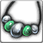

<!-- generated:start -->
<!-- generated-keys: title=30ded9 type=d36ca9 id=668f37 sources=70bd86 name_key=35f780 kind=80e28a kind_name=7b4b74 classes=92d079 bind=883bf8 price=e0f635 cost_pair=9ce603 rarity=356a19 stats=0c38aa reinforce=da4b92 icon=4aaf5d obtained_from=7a497e -->
|  |  |
|---|---|
|  |  |
| **Item id** | `461` |
| **Kind** | Necklace (54) |
| **Classes** | all |
| **Bind** | on pickup |
| **Buy price** | 1,500 Gold |
| **Rarity (guessed column)** | 1 |
| **Icon** | `ui/icons/Items_08.png` cell 54 |

### Stats

Weapon and armour stats grow with the item: the client multiplies the first three option slots by *tier × 15 + reinforce level* and the next three by the *tier*; the rest are flat (`FUN_004410d6`, *client*; reading of the two multipliers is *inferred*).

| stat | value | applies | code |
|---|---|---|---|
| Attack | +7 | × (tier × 15 + reinforce level) | 1 |
| Health | +10 | × (tier × 15 + reinforce level) | 31 |
| Attack | +11 | × tier | 1 |
| Health | +20 | × tier | 31 |
| Attack Speed(%) | Attack Speed +1% | × tier | 103 |
| Attack | +88 | flat | 1 |
| Health | +275 | flat | 31 |
| Attack Speed(%) | Attack Speed +3% | flat | 103 |
| Mana Regeneration | +2 | flat | 34 |

### Reinforcement

ItemSancMet row 2 (inferred from Item_Base +0x92), 1,000 gold per attempt. Success rates are not in the client.

| step | materials |
|---|---|
| 1 | [[wiki/items/601-blue-passion-fragments-d\|Blue Passion Fragments (D)]] × 4 |
| 2 | [[wiki/items/602-blue-passion-piece-d\|Blue Passion Piece (D)]] × 4 |
| 3 | [[wiki/items/603-blue-passion-fragments-c\|Blue Passion Fragments (C)]] × 6 |
| 4 | [[wiki/items/604-blue-passion-piece-c\|Blue Passion Piece (C)]] × 10 |
| 5 | [[wiki/items/605-blue-passion-fragments-b\|Blue Passion Fragments (B)]] × 10 |
| 6 | [[wiki/items/606-blue-passion-piece-b\|Blue Passion Piece (B)]] × 15 |

### Where to get it

- Hero gacha pool 01, grade 2 (Gacha_01.cdb; odds are server side)
- Hero gacha pool 04, grade 3 (Gacha_04.cdb; odds are server side)

### Mentioned in

- [[gameplay/maps-and-dungeons|Maps and dungeons]]
<!-- generated:end -->

## Notes

<!-- hand-written: add what you know, with a source -->

## Behaviour

<!-- hand-written: add what you know, with a source -->

## Sources

<!-- hand-written: add what you know, with a source -->

## Open questions

<!-- hand-written: add what you know, with a source -->

<!-- credit:start -->
---
*Game content © GAMESinFLAMES / Joyimpact; reproduced for preservation and reference.*
<!-- credit:end -->
