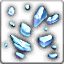

<!-- generated:start -->
<!-- generated-keys: title=650a5b type=d36ca9 id=97e01b sources=169e53 name_key=1fbaf9 kind=7b5200 kind_name=59f0ad classes=92d079 bind=2be88c price=936627 cost_pair=ebf7c2 stats=97d170 icon=81d0e5 obtained_from=97d170 -->
|  |  |
|---|---|
|  |  |
| **Item id** | `671` |
| **Kind** | Material (12) |
| **Classes** | all |
| **Buy price** | 100 Gold |
| **Icon** | `ui/icons/Items_26.png` cell 30 |

### Tooltip

> Reinforcement Materials of Item

### Where to get it

Nothing in the client data. Monster drops are server data: add them to the monster's page (`drops:`) or to this page's `obtained_from:`.
<!-- generated:end -->

## Notes

<!-- hand-written: add what you know, with a source -->

## Behaviour

<!-- hand-written: add what you know, with a source -->

## Sources

<!-- hand-written: add what you know, with a source -->

## Open questions

<!-- hand-written: add what you know, with a source -->

<!-- credit:start -->
---
*Game content © GAMESinFLAMES / Joyimpact; reproduced for preservation and reference.*
<!-- credit:end -->
