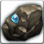

<!-- generated:start -->
<!-- generated-keys: title=dbf68d type=d36ca9 id=6d3eeb sources=1d4f50 name_key=281e37 kind=667be5 kind_name=8e0d16 classes=92d079 bind=2be88c price=32a324 cost_pair=395e20 stats=97d170 icon=5cdcd2 obtained_from=97d170 -->
|  |  |
|---|---|
|  |  |
| **Item id** | `692` |
| **Kind** | Jewel (58) |
| **Classes** | all |
| **Buy price** | 0 Gold |
| **Icon** | `ui/icons/Items_08.png` cell 6 |

### Tooltip

> [Low]Gem Stone for disassemble
>
> You can acquire Crystal.

### Where to get it

Nothing in the client data. Monster drops are server data: add them to the monster's page (`drops:`) or to this page's `obtained_from:`.

### Current server

`server/loot.py` drops it (our choice, not original data): [[wiki/monsters/605-great-slime|Great Slime]] 25% × 1–1

### Mentioned in

- [[gameplay/dungeon-drops|Dungeon drops (ores and herbs)]]
- [[gameplay/reinforce-and-runes|Reinforce, tier-up and rune numbers]]
- [[gameplay/video-dungeon-run|Video notes: Nas Village dungeon run (ZonderCoRe)]]
- [[gameplay/video-early-quests|Video notes: first session, levels 1+ (charmanmugen)]]
<!-- generated:end -->

## Notes

<!-- hand-written: add what you know, with a source -->

## Behaviour

<!-- hand-written: add what you know, with a source -->

## Sources

<!-- hand-written: add what you know, with a source -->

## Open questions

<!-- hand-written: add what you know, with a source -->

<!-- credit:start -->
---
*Game content © GAMESinFLAMES / Joyimpact; reproduced for preservation and reference.*
<!-- credit:end -->
