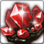

<!-- generated:start -->
<!-- generated-keys: title=dd2a05 type=d36ca9 id=00a691 sources=52d2a5 name_key=eec077 kind=667be5 kind_name=8e0d16 classes=92d079 bind=2be88c price=3965d0 cost_pair=a4823c stats=97d170 icon=dd654d obtained_from=0e6005 -->
|  |  |
|---|---|
|  |  |
| **Item id** | `695` |
| **Kind** | Jewel (58) |
| **Classes** | all |
| **Buy price** | 400 Gold |
| **Icon** | `ui/icons/Items_08.png` cell 8 |

### Tooltip

> [High]Gem Stone for disassemble
>
> You can acquire Crystal.

### Where to get it

- Sold in [[wiki/shops/56-shop-56-no-npc|Shop 56 (no NPC)]] (no NPC found)
- Sold in [[wiki/shops/60-shop-60-no-npc|Shop 60 (no NPC)]] (no NPC found)
- Sold in [[wiki/shops/101-shop-101-no-npc|Shop 101 (no NPC)]] (no NPC found)
- Sold in [[wiki/shops/105-shop-105-no-npc|Shop 105 (no NPC)]] (no NPC found)
- Sold in [[wiki/shops/109-shop-109-no-npc|Shop 109 (no NPC)]] (no NPC found)
- Sold in [[wiki/shops/211-shop-211-no-npc|Shop 211 (no NPC)]] (no NPC found)
- Sold in [[wiki/shops/212-shop-212-no-npc|Shop 212 (no NPC)]] (no NPC found)
- Sold in [[wiki/shops/213-shop-213-no-npc|Shop 213 (no NPC)]] (no NPC found)
- Sold in [[wiki/shops/217-shop-217-no-npc|Shop 217 (no NPC)]] (no NPC found)
- Sold in [[wiki/shops/218-shop-218-no-npc|Shop 218 (no NPC)]] (no NPC found)
- Sold in [[wiki/shops/226-shop-226-no-npc|Shop 226 (no NPC)]] (no NPC found)
- Sold in [[wiki/shops/227-shop-227-no-npc|Shop 227 (no NPC)]] (no NPC found)
- Sold in [[wiki/shops/233-shop-233-no-npc|Shop 233 (no NPC)]] (no NPC found)
- Sold in [[wiki/shops/234-shop-234-no-npc|Shop 234 (no NPC)]] (no NPC found)
- Shown as a reward of dungeon [[wiki/dungeons/129-lv-8-thorn-s-hell|(Lv 8) Thorn's Hell]]
- Shown as a reward of dungeon [[wiki/dungeons/133-sinking-nest-crystal|Sinking Nest (Crystal)]]
- Shown as a reward of dungeon [[wiki/dungeons/142-lv-9-dragon-island|(Lv 9) Dragon Island]]

### Mentioned in

- [[gameplay/dungeon-drops|Dungeon drops (ores and herbs)]]
<!-- generated:end -->

## Notes

<!-- hand-written: add what you know, with a source -->

## Behaviour

<!-- hand-written: add what you know, with a source -->

## Sources

<!-- hand-written: add what you know, with a source -->

## Open questions

<!-- hand-written: add what you know, with a source -->

<!-- credit:start -->
---
*Game content © GAMESinFLAMES / Joyimpact; reproduced for preservation and reference.*
<!-- credit:end -->
