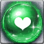

<!-- generated:start -->
<!-- generated-keys: title=2c9f18 type=d36ca9 id=b1e381 sources=b76f61 name_key=ac1dbc kind=972a67 kind_name=a3317b classes=92d079 bind=883bf8 price=8c6ae2 cost_pair=982f5a rune_level=b6589f stats=05a210 options=37a1ac icon=b33061 obtained_from=53c270 -->
|  |  |
|---|---|
|  |  |
| **Item id** | `7042` |
| **Kind** | Rune (35) |
| **Classes** | all |
| **Bind** | on pickup |
| **Buy price** | 10 Gold |
| **Icon** | `ui/icons/Items_28.png` cell 26 |

### Tooltip

> The Rune ability is applied, when equip weapon which set Runes..

### Stats

| stat | value | applies | code |
|---|---|---|---|
| Health | +50 | flat | 31 |
| Health | +50 | flat (from Item_Jewel) | 31 |

### Other options

| code | value | meaning |
|---|---|---|
| 202 | 5 | rune grade? |

### Crafting

| recipe | materials | gold | success % |
|---|---|---|---|
| 1805 | [[wiki/items/700-crystal-blue\|Crystal : Blue]] × 10, [[wiki/items/802-garnet\|Garnet]] × 2 | 200 | 100 |

### Where to get it

- Reward of quest [[wiki/quests/53-safety-factor-management|Safety factor Management]] × 1
- Reward of quest [[wiki/quests/123-rune-reinforcement|Rune Reinforcement]] × 1
- In random box table row 46 (RandomBox.cdb; odds are server side)
<!-- generated:end -->

## Notes

<!-- hand-written: add what you know, with a source -->

## Behaviour

<!-- hand-written: add what you know, with a source -->

## Sources

<!-- hand-written: add what you know, with a source -->

## Open questions

<!-- hand-written: add what you know, with a source -->

<!-- credit:start -->
---
*Game content © GAMESinFLAMES / Joyimpact; reproduced for preservation and reference.*
<!-- credit:end -->
