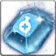

<!-- generated:start -->
<!-- generated-keys: title=cbe828 type=d36ca9 id=0fa69b sources=cabd65 name_key=97e3ab kind=972a67 kind_name=a3317b classes=92d079 bind=883bf8 price=8c6ae2 cost_pair=982f5a rune_level=da4b92 stats=6872c9 options=b7f834 icon=e27fac obtained_from=4e50b1 -->
|  |  |
|---|---|
|  |  |
| **Item id** | `7074` |
| **Kind** | Rune (35) |
| **Classes** | all |
| **Bind** | on pickup |
| **Buy price** | 10 Gold |
| **Rune level** | 2 |
| **Icon** | `ui/icons/Items_28.png` cell 18 |

### Tooltip

> The Rune ability is applied, when equip weapon which set Runes..

### Stats

| stat | value | applies | code |
|---|---|---|---|
| Mana Regeneration | +4 | flat | 34 |
| Mana Regeneration | +24 | flat (from Item_Jewel) | 34 |

### Other options

| code | value | meaning |
|---|---|---|
| 202 | 8 | rune grade? |

Jewel upgrade (JewelSocketMake 72): [[wiki/items/700-crystal-blue|Crystal : Blue]] × 15, [[wiki/items/611-red-passion-fragments-d|Red Passion Fragments (D)]] × 15 from [[wiki/items/7073-mana-regeneration-rune|Mana Regeneration Rune]].

### Where to get it

Nothing in the client data. Monster drops are server data: add them to the monster's page (`drops:`) or to this page's `obtained_from:`.
<!-- generated:end -->

## Notes

<!-- hand-written: add what you know, with a source -->

## Behaviour

<!-- hand-written: add what you know, with a source -->

## Sources

<!-- hand-written: add what you know, with a source -->

## Open questions

<!-- hand-written: add what you know, with a source -->

<!-- credit:start -->
---
*Game content © GAMESinFLAMES / Joyimpact; reproduced for preservation and reference.*
<!-- credit:end -->
