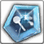

<!-- generated:start -->
<!-- generated-keys: title=a02465 type=d36ca9 id=5c69aa sources=e506eb name_key=d937d7 kind=972a67 kind_name=a3317b classes=92d079 bind=883bf8 price=8c6ae2 cost_pair=982f5a rune_level=77de68 stats=976b9c options=f4abe0 icon=6b5385 obtained_from=45d94f -->
|  |  |
|---|---|
|  |  |
| **Item id** | `7135` |
| **Kind** | Rune (35) |
| **Classes** | all |
| **Bind** | on pickup |
| **Buy price** | 10 Gold |
| **Rune level** | 3 |
| **Icon** | `ui/icons/Items_28.png` cell 9 |

### Tooltip

> The Rune ability is applied, when equip weapon which set Runes..

### Stats

| stat | value | applies | code |
|---|---|---|---|
| Spell Vamp(%) | Spell Vamp +4% | flat | 43 |
| Spell Vamp(%) | Spell Vamp +7% | flat (from Item_Jewel) | 43 |

### Other options

| code | value | meaning |
|---|---|---|
| 202 | 14 | rune grade? |

Jewel upgrade (JewelSocketMake 133): [[wiki/items/701-crystal-yellow|Crystal : Yellow]] × 40, [[wiki/items/613-red-passion-fragments-c|Red Passion Fragments (C)]] × 20, [[wiki/items/855-mysterious-passion|Mysterious Passion]] × 1 from [[wiki/items/7134-spell-vamp-rune|Spell Vamp Rune]].

### Where to get it

Nothing in the client data. Monster drops are server data: add them to the monster's page (`drops:`) or to this page's `obtained_from:`.
<!-- generated:end -->

## Notes

<!-- hand-written: add what you know, with a source -->

## Behaviour

<!-- hand-written: add what you know, with a source -->

## Sources

<!-- hand-written: add what you know, with a source -->

## Open questions

<!-- hand-written: add what you know, with a source -->

<!-- credit:start -->
---
*Game content © GAMESinFLAMES / Joyimpact; reproduced for preservation and reference.*
<!-- credit:end -->
